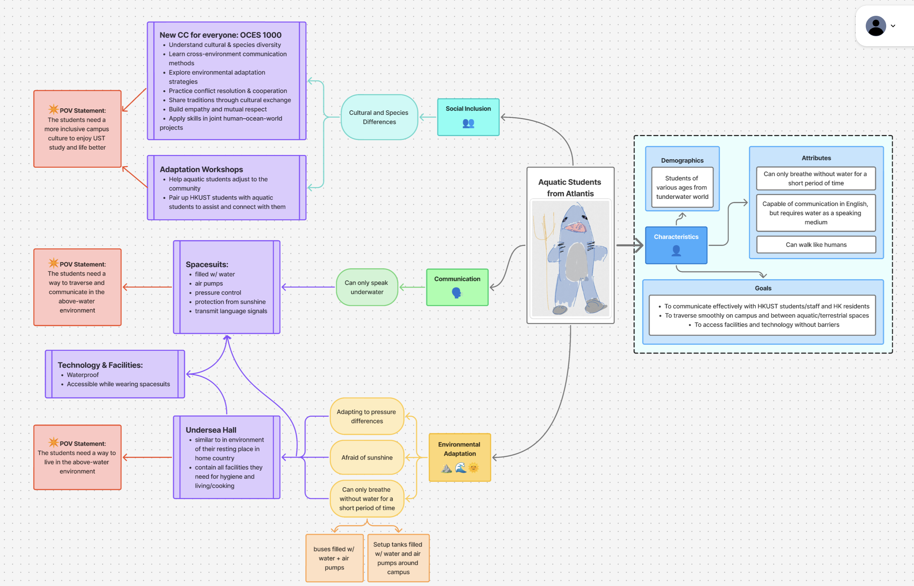

# Diary 1: Atlantic exchange students

[Home Page](../../README.md) | [Previous Diary](./Diary0.md) | [Next Diary]()

# TOC
- [Diary 1: Atlantic exchange students](#diary-1-atlantic-exchange-students)
- [TOC](#toc)
- [Mindmap](#mindmap)
- [Personal contributions and Achievements](#personal-contributions-and-achievements)
- [Diary](#diary)

# Mindmap
(GenAI was used in the process)

# Personal contributions and Achievements
- Proposed the use of a spacesuit filled with water to allow the students to adapt to our environment
- drew the avatar for the student
- presented the initial idea to the class

# Diary
Having not worked with a new team in a long while, this is a refreshing experience. This team allowed me to think creatively and inclusively (I had a bit of fun drawing the shark/student too), and process has also allowed me to think from multiple different perspectives,