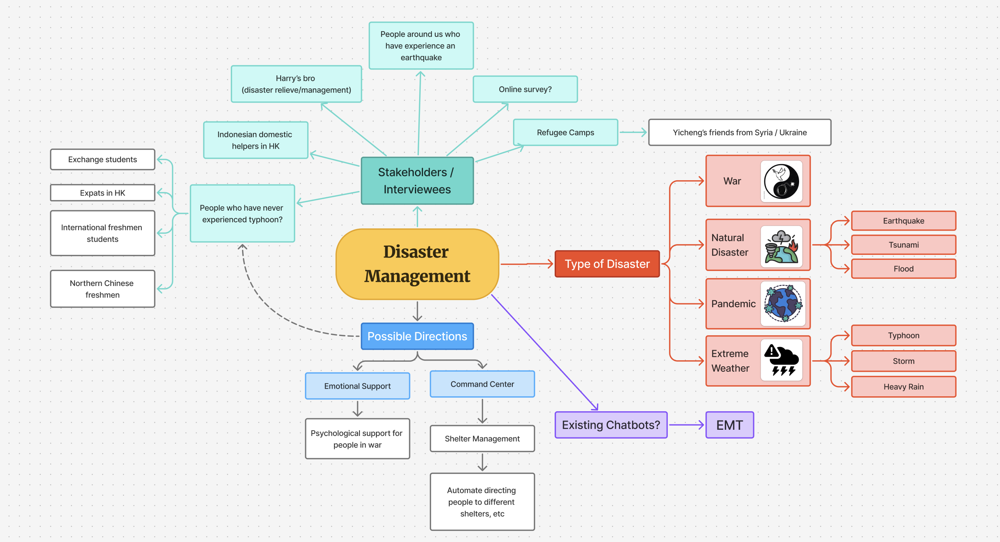
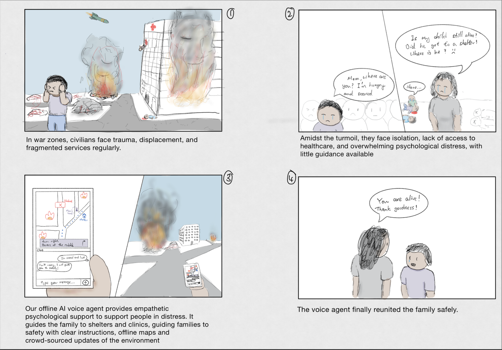

# Diary 2: Chatbot for Disaster Management

[Home Page](../../README.md) | [Previous Diary](./Diary1.md) | [Next Diary]()

# TOC
- [Diary 2: Chatbot for Disaster Management](#diary-2-chatbot-for-disaster-management)
- [TOC](#toc)
- [Mindmap](#mindmap)
- [Personal contributions and Achievements](#personal-contributions-and-achievements)
- [storyboard (my first drafts)](#storyboard-my-first-drafts)
- [Diary](#diary)

*Note:* GenAI was used in the design process.

# Mindmap

# Personal contributions and Achievements
- ideation: provide various ideas and directions
- researched the logistics of disaster management
- drawing some of the storyboards
- usability questionnaire
- presentation sides
- prototype: initial setup of streamlit and implementation of the LLM prompt structure

# storyboard (my first drafts)
These drawings were not used directly since I accidentally drew the combination of all 3 ideas that we had. In the end, we modified and added to the storyboards.

# Diary
The most memorable part of the project was creating the presentation slides and video demo. Since the presentation date was set close to our exam, the schedule was very tight and we had to rush the presentation preparations. At the end, some of us stayed up till 7am to complete the presenation slides.

> View of the sunrise from home at 6:20am on the day of the presentation
> 