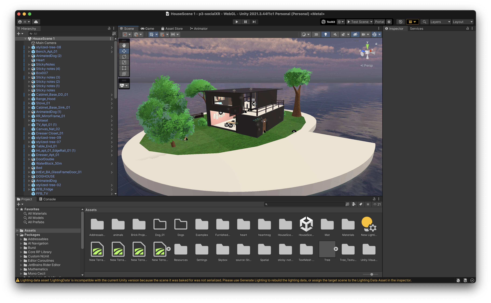
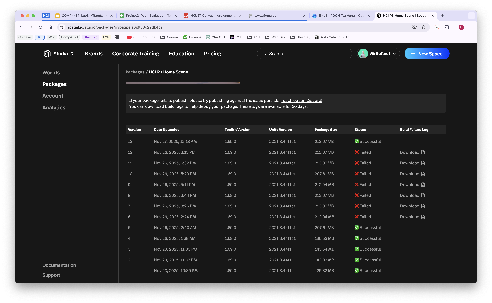
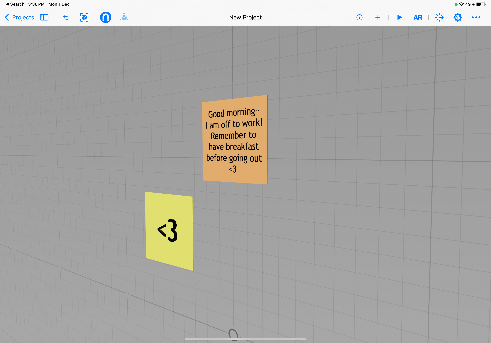
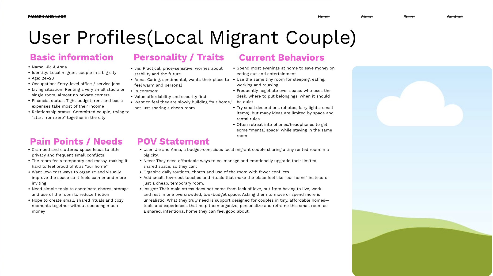
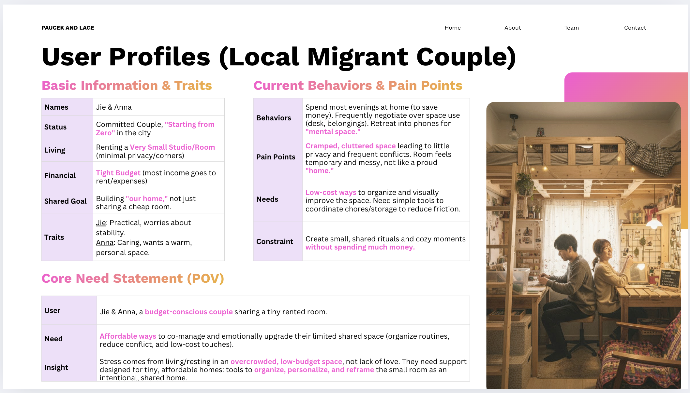

# Diary 3: Social XR

[Home Page](../../README.md) | [Previous Diary](./Diary2.md) 

# TOC
- [Diary 3: Social XR](#diary-3-social-xr)
- [TOC](#toc)
- [EverPresence](#everpresence)
  - [What I did](#what-i-did)
  - [Unity + Spatial](#unity--spatial)
  - [Issues with Spatial](#issues-with-spatial)
  - [Wizard of Oz](#wizard-of-oz)
  - [Presentation](#presentation)
- [What happened](#what-happened)

*Note:* GenAI was used in the design process.

# EverPresence
(This diary will be of a slightly differnet format to the previous ones, since there are a lot more to add this time.)

The goal of this project was to build a social XR system. Our group chose to use Unity and Spatial for the prototype, as it was the recommended to us during the lab sessions. 

Spatial has allowed us to not have to worry about things like multiplayer support, screen sharing, and a plethora of things that would otherwise take a very long time to complete, but as is with most things, it's not all sunshine and butterflies.

Collaboration with most of the group essentially fell apart after the ideation phase, which made the project take far longer than it was supposed to. There was a lot of... less than optimal presentation slide designs, which meant that when I (and one other groupmate) was finally able to start on the presentation slides, there were a lot of adjustments needed.

## What I did
Most of my work in this project is related to setting up the prototypes as well as the presentations slides, and provided various ideas in the ideation phase. I also had a part in the brainstorming of the various demo video scenes.

## Unity + Spatial
Whilst I had some experience is using unity, it was very limited. It still helped in this project as I did not have to completely learn it from scratch. 
What I did have to learn, however, was spatial. Some time was spent in the beginning in understanding how we would incorporate the interactions from different prefabs found in Unity's asset store. 

Designing the virtual house itself was not too big of an issue, as I based the initial design off a paper model that I had built a few years ago

In the end, this was the design of our virtual house.

## Issues with Spatial
The day before our presentation, Spatial faced issues with their server, which caused us to be unable to upload any new changes. 

It took a few hours before we realised it was an issue with spatial, since we were still receiving emails telling us that the world is ready. It did not help that the emails did not actually include any useful information about the world itself, even before the server issues occured.

## Wizard of Oz
The memos feature of our prototype required a Wizard of Oz implementation, as we were unable to create projected images. In the end, we chose to use Apple's Reality Composer to show the memos appearing when a user in the virtual space writes a memo.

## Presentation
This is the part that really had my blood boiling, so to speak. 

This was one of the presentation slides I was greeted with when I was finally able to start working on it. The isse here is pretty much self-explanatory.

After a bit of discussion with the original person that did it, the slide was change to this.

By the deadline, the project slides were still very messy, and even though me and another groupmate both had multiple presentations that day, we still stayed up to tidy up the slides. 

# What happened
There are 5 of us in this project, here I will name my groupmates as A, B, C, and D

In the brainstorming stage, A B C and me met after class to share our ideas. The issue? C did not know what was going on. Turns out they were messaging someone else instead of actually participating in the meeing. 

Afterwards, A, B, C, and D did the first interviews whilst I searched for general existing solutions. All 5 of us did storyboards afterwards. 

Skipping ahead to the prototyping phase, I started with the initial design of the virtual house, and A implemented some interactions with the pets that the users would share. B helped modify the design of the virtual world, so that the users may try out our prototype.

During this, neither C nor D participated much in the discussions for this project, and we were unable to contact them at times. At the end, we had to delegate the presentation slides to those two, which resulted in... that.

I have left out a lot of details here since there really isn't much that can be done now, but I wish for future courses there will be peer evalutations within a group.
