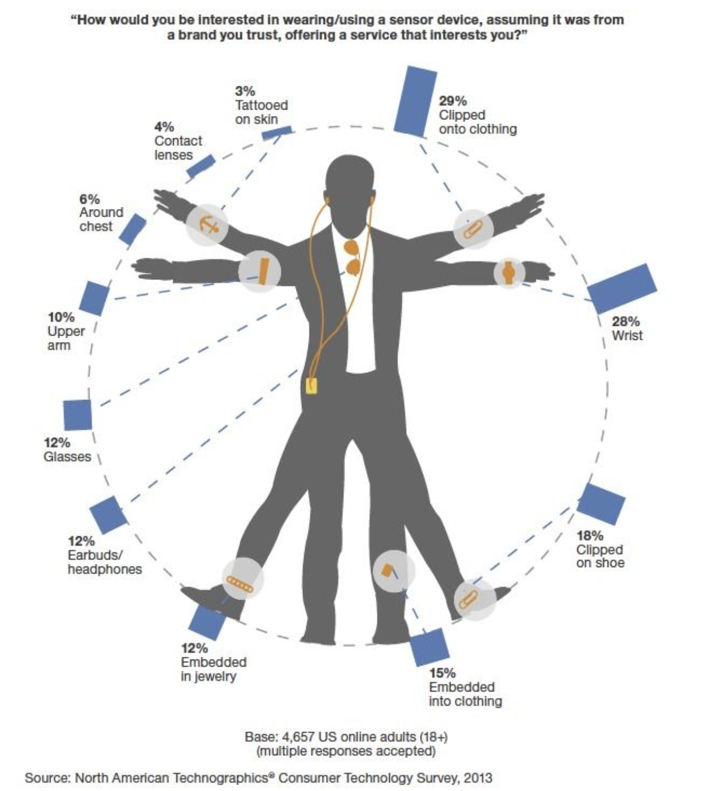
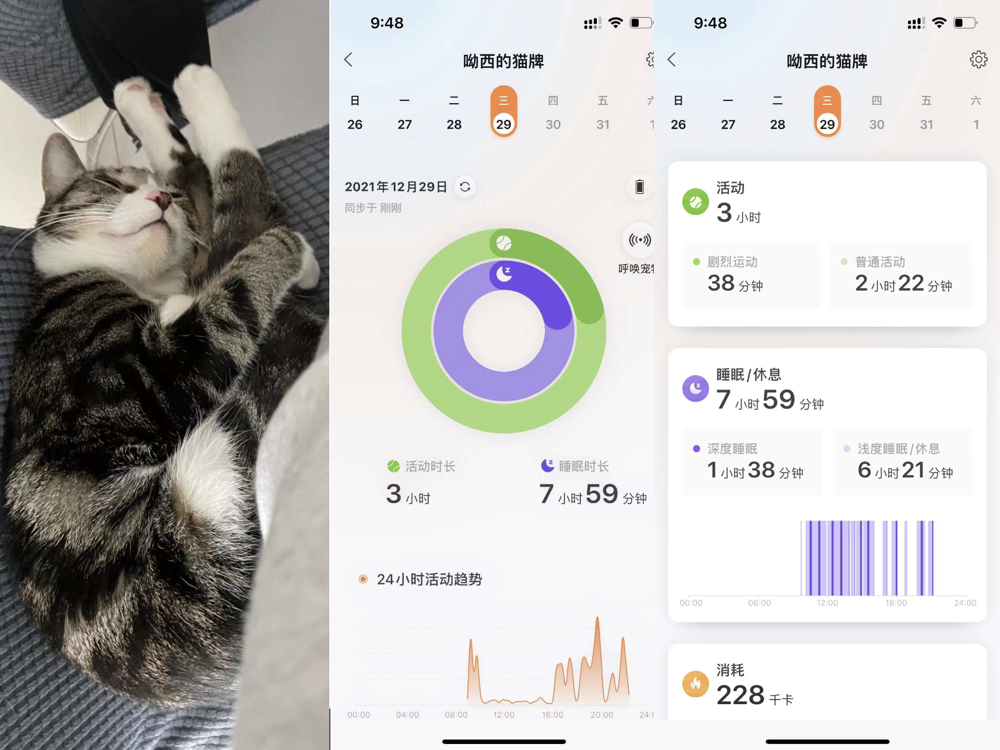
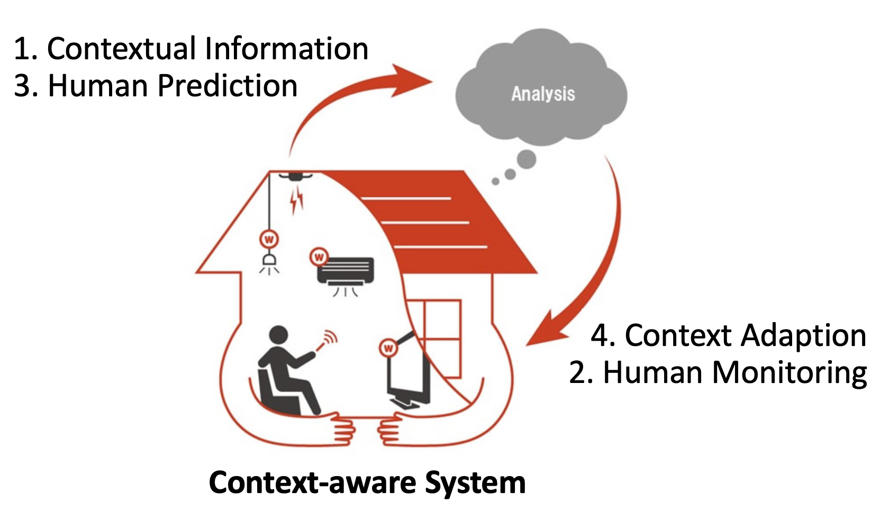
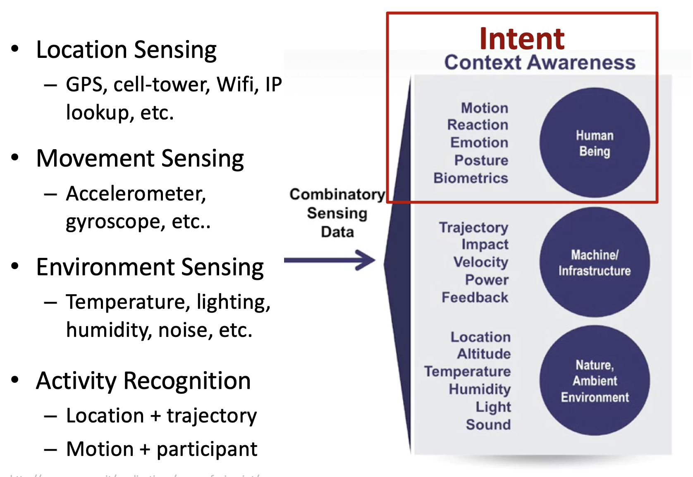
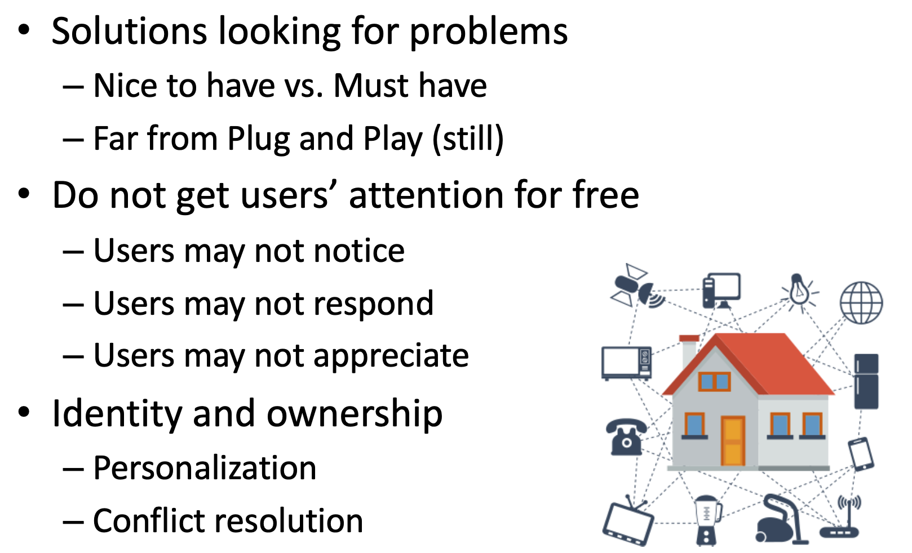

# Comp 4461 Lecture 10 (2/10/2025): Prototyping
[Home Page](../../README.md) | [Previous Lecture](./notes_L8.md) | [Next Lecture]()

- [Comp 4461 Lecture 10 (2/10/2025): Prototyping](#comp-4461-lecture-10-2102025-prototyping)
- [Ubiquitous Computing](#ubiquitous-computing)
  - [Enabling Technologies](#enabling-technologies)
  - [Potential Challenges](#potential-challenges)
  - [Connections to HCI](#connections-to-hci)
    - [Interaction](#interaction)
    - [Intelligent](#intelligent)
  - [Three Keywords -\> Three Application Domains](#three-keywords---three-application-domains)
    - [User-Centric Computing](#user-centric-computing)
      - [Privacy](#privacy)
    - [Context-aware computing](#context-aware-computing)
      - [Evoltion of "Context aware"](#evoltion-of-context-aware)
      - [Problems with Smart Environment](#problems-with-smart-environment)
      - [Possible Applications](#possible-applications)

# Ubiquitous Computing

> "The most profound technologies are those that disappear. They weave themselves into the fabric of everyday life until they are indistinguishable from it."\
> ---- Mark Weiser, 
> "The Computer for the 21st Century"

- Components
  - Everyday user
  - Everyday object 
  - Everyday activity
- Characteristics
  - Embedded (invisible) 
  - Connected
  - Distributed
  - Mobile

## Enabling Technologies
- Embedded processors and sensors 
  - Small form factor
  - Low expenses
  - Enduring Energy
  - Processing power
  - Data storage
  - Data communication

## Potential Challenges
- Heterogeneity in hardware
  - Sensors
  - Computing platforms
  - Interaction modalities
- Heterogeneity in software and standards
  - OS, communication standards, etc.
- Heterogeneity in device-human relations
  - 1:1 (device = owner), e.g., smartphone
  - 1:many, e.g., smart thermostat
  - many:many, e.g., rental bike
 

## Connections to HCI 
### Interaction
- Enrich interactions
- Make physical objects interactive & intelligent

e.g. making a plant talk to you by embedding sensors in the soil

### Intelligent

- Human-Data Relationship
  - Get data from humans
  - Present data to humans
  - Learn about humans from data
  - Facilitate humans based on data

## Three Keywords -> Three Application Domains
User-centric | Context-aware | Data-driven
-- | -- | --
Personal | Smart | Urban 
Informatics | Home | Dynamics

### User-Centric Computing
- Personal Informatics ("Quantified Self")
  - Help people collect personally relevant information for the purpose of self-reflection and gaining self-knowledge.
  - sensors used by people 

#### Privacy
- Privacy as Individual Property
  - (you may sell your privacy)

- Would you like to sell your dinner menu to?
  - To Openrice
  - To Google
  - To your health insurance company
  - To the C.I.A.

- Would you sell your trajectory for?
  - For rights to go to your past
  - For rights to go to your future

### Context-aware computing

> Context is “any information that can be used to characterize the situation of an entity. An entity is a person, place or object that is considered relevant to the interaction between a user and an application including the user and the application themselves.”
> -- Anind Dey

- Identity
- Location (and Time) 
- Activity
- Intent

Context: user info (age, preferences, identity, etc...)

#### Evoltion of "Context aware" 
0. Authentication
  -  may need redundancies for smart systems
1. adapt according to the location of use
2. provides information and/or services to the use relevant to the user’s task / activity
3. understand and act on human intent without interruption

#### Problems with Smart Environment

#### Possible Applications
- Data
  - Spatial information, e.g., POI, road network
  - Human flow, e.g., pedestrian, public transit, cars, etc. 
  - Human activities, e.g., concert, sports, etc.
  - Contextual information, e.g., weather
- Applications, e.g.,
  - City and infrastructure planning
  - Traffic control and risk management 
  - Travel planning
  - Pollution management