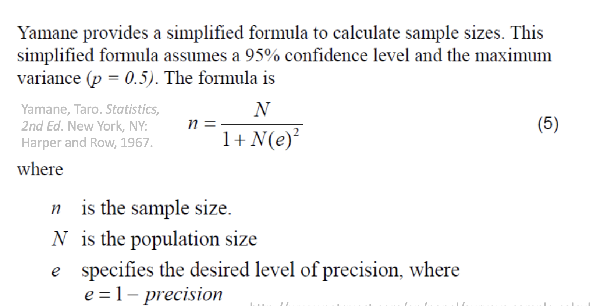
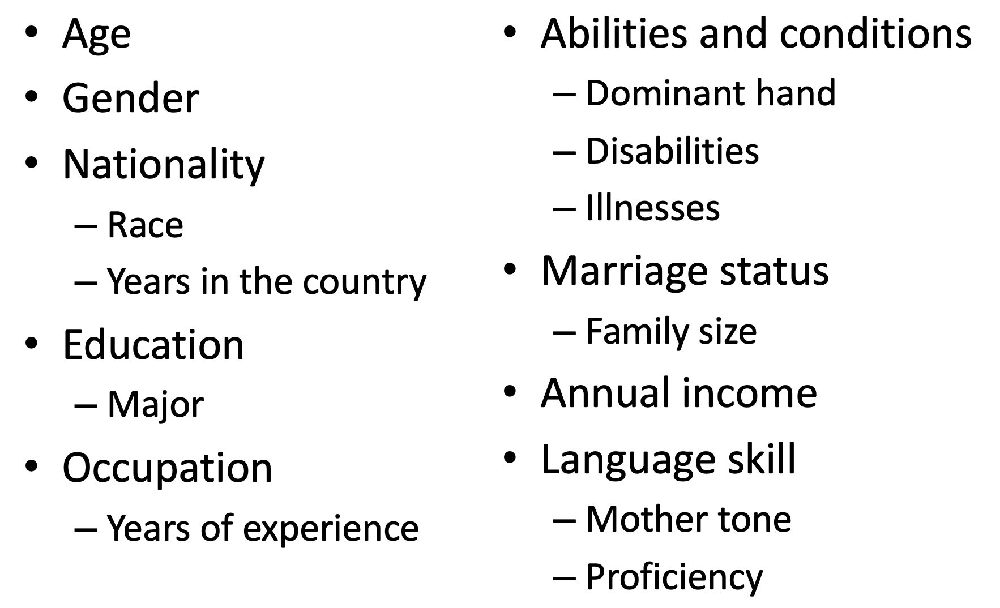
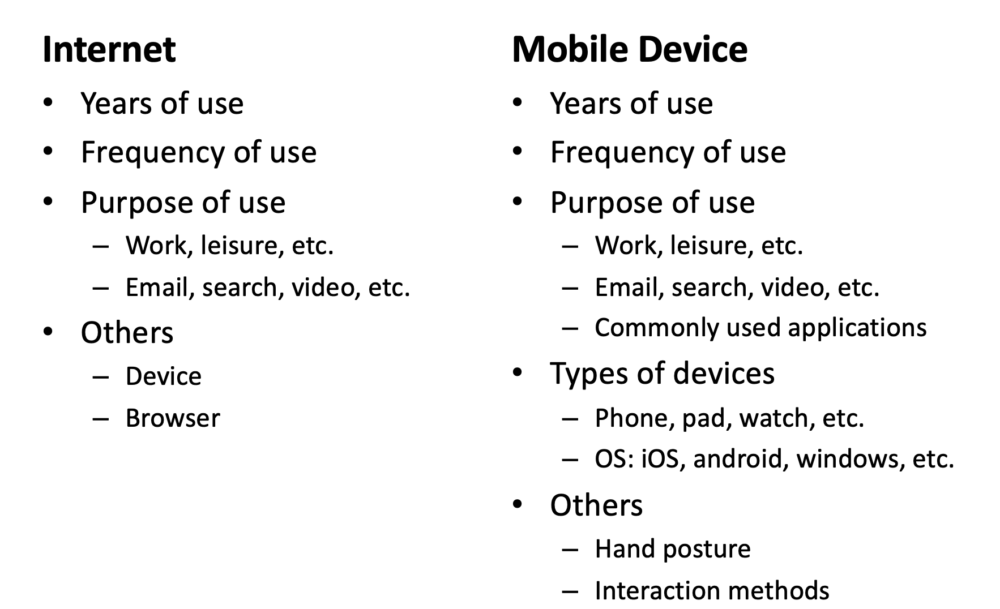
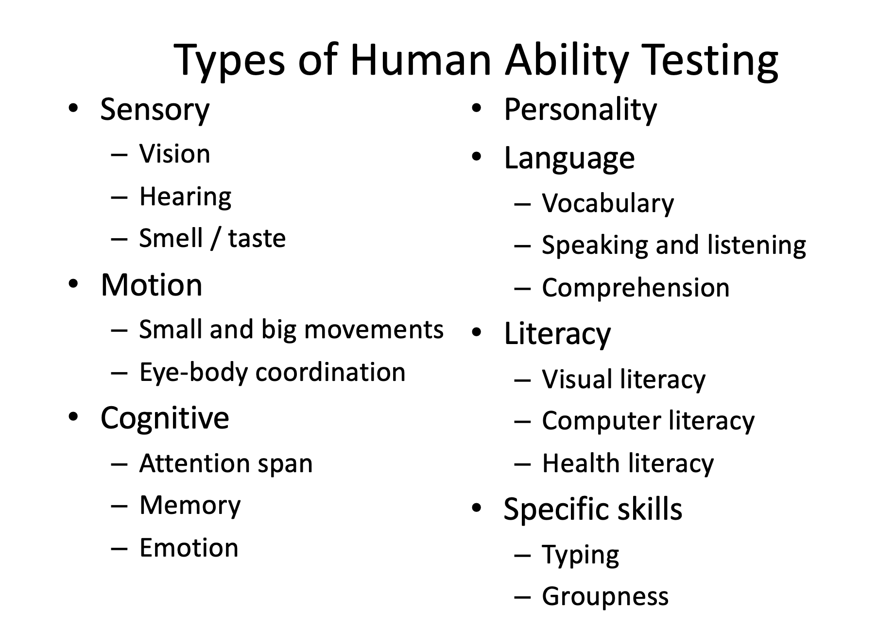

# Comp 4461 Lecture 11 (9/10/2025): Evaluation
[Home Page](../../README.md) | [Previous Lecture](./notes_L10.md) | [Next Lecture]()

- [Comp 4461 Lecture 11 (9/10/2025): Evaluation](#comp-4461-lecture-11-9102025-evaluation)
- [User Sampling Method](#user-sampling-method)
  - [Sample Size](#sample-size)
  - [Rule-of-Thumb Sample Size](#rule-of-thumb-sample-size)
  - [Recruitment Methods (for finding people to do questionnaire)](#recruitment-methods-for-finding-people-to-do-questionnaire)
- [Self report: Getting Insights into the Users](#self-report-getting-insights-into-the-users)
- [Questionnaire Design](#questionnaire-design)
    - [Question Types](#question-types)
      - [Categorical Questions](#categorical-questions)
      - [Likert Scale](#likert-scale)
  - [Questionnaire Wording](#questionnaire-wording)
  - [Questionnaire Organization](#questionnaire-organization)
    - [Demographic Questions](#demographic-questions)
    - [Substantive Questions](#substantive-questions)
    - [Experience Questions (e.g.)](#experience-questions-eg)
  - [Page Format Guidelines](#page-format-guidelines)
  - [Questionnaire Design Guidelines](#questionnaire-design-guidelines)
  - [Pilot Stress Testing of your Questionnaire](#pilot-stress-testing-of-your-questionnaire)
  - [Unavoidable Response Bias](#unavoidable-response-bias)
  - [Sensitive Questions](#sensitive-questions)
  - [Reliability and Validity](#reliability-and-validity)
  - [How to Prompt Respondents?](#how-to-prompt-respondents)
  - [Be Aware of the Effect of Environmental Cue](#be-aware-of-the-effect-of-environmental-cue)
  - [Human Ability Testing](#human-ability-testing)
- [(in-class activity) Letter Fluency Test](#in-class-activity-letter-fluency-test)
- [(in-class activity) Health Fluency Test](#in-class-activity-health-fluency-test)

# User Sampling Method
- **A non-probability sample** uses human judgment in selecting respondents:
  - Convenience samples (e.g., at a conference/event)
  - Judgment samples (e.g., selected experts)
  - Self-selecting sample (e.g., web survey open to anyone)

- Do not ensure that the sample is representative of the population:
  - (Acceptable) Findings are unique for a set of users
  - (Not acceptable) Just because of your unwillingness

- **Probability samples** can be obtained through a variety of sampling methods:
  - Simple random sampling
  - Systemic sampling
  - Stratified sampling
  - Cluster sampling

- Choose the method based on:
  - Size and nature of the population
  - Time and cost involved
  - Known population characteristics
  

## Sample Size

- The appropriate sample size is a function of:
  - Precision desired
  - Confidence level desired
  - Population size (when the population is small)\
  

## Rule-of-Thumb Sample Size
- Rapid, iterative prototyping: 5+ participants
- Lab User Study
  | Relationship                                   | Reasonable sample size                                      |
  |------------------------------------------------|-------------------------------------------------------------|
  | Measuring group differences (e.g., t-test, ANOVA) | Cell size of 30 for 80% power; if decreased, no lower than 7 per cell. |
  | Relationships (e.g., correlations, regression)  | ~50                                                        |
  | Chi-Square                                     | At least 20 overall, no cell smaller than 5                 |
  | Factor Analysis                                | ~300 is "good"                                             |

- Field testing (e.g., A-B testing): a (randomly) selected portion of the user population

## Recruitment Methods (for finding people to do questionnaire)
- Participant Pool
- Word of Mouth
  - Snowballing effect
- Flyers, Posters, Advertisement
  - In places where people hangout
- Mailing List (*make it seem like little effort is needed with good reward*)
- Forum
- Social Media

# Self report: Getting Insights into the Users

- **Questionnaires (paper, email, web)**
  - Sample a larger population
  - Ask multiple questions efficiently
  - Use a variety of modes
  - Comparatively low cost

- **Interviews**
  - Effective way of enlisting cooperation
  - Ability to probe and follow-up
  - Capture multiple sources of data
  - Rapport building for sensitive issues

# Questionnaire Design

- How will the survey be mediated?
  - Paper, email soft copy, web
  - What other documents might be included?
- How long should the questionnaire be?
  - Each additional question can reduce response rate by 0.5%, and each additional page by 5%
  - Significant decrease in response rates for questionnaires longer than four pages
- How to structure and organize the questionnaire?
- How to design and format the page?

### Question Types

- **Open-ended questions**
  - Too many options
  - Details

- **Close-ended questions**
  - Unordered options
    - List of categories
  - Ordered options
    - Dichotomous response scales (e.g., yes/no)
    - Ordinal response scales (e.g., poor, fair, good, very good)
  - Rank

- **Hybrid questions**

#### Categorical Questions
Choices should be mutually exclusive (e.g. no overlapping dates) and exhaustive

#### Likert Scale
- **Size**
  - Common: 5-point (0-4/1-5), 7-point (1-7), 9-point (1-9)
  - Odd number with undecided/neutral in the middle
  - Even number to avoid neutral answers

## Questionnaire Wording

- Be specific, but not too specific
- Use simple words and sentences
  - ***Avoid*** complex constructions like "Do you like ... which ... that ... as ... ?"
- Highlight necessary key words, e.g., **NOT**
- Avoid double negatives
  - Example to avoid: "Do you never use ... ?" [Yes/No]
- Avoid bias
  - Example to avoid: "Do you like ... ?" [A lot/Very much]
- Avoid hypothetical questions

## Questionnaire Organization

- **Question Grouping and Sequencing**
  - Demographic questions
  - Filter questions, if any
  - Substantive questions

- **Questionnaire Structure**
  - Title
  - Introduction and instructions
  - (Section title)
  - (Definition)
  - Questions
  - (Transition)

### Demographic Questions

### Substantive Questions
- Regarding the targeted topic
- Regarding experiences that may have an impact
  - Personal life experiences, e.g., music
  - Experiences with particular technologies

### Experience Questions (e.g.)

## Page Format Guidelines
(See lecture notes)

- Good alignment
  - Keep answer choices on the right hand side
- Good use of **wide space or grouping**
  - No splitting questions across pages
- Use bold, italic, simple highlights if necessary
  - Do not use too many font types, sizes, or colors
  - No ALL CAPS
- Make your page readable
  - At least 10pt font
  - Good contrast between background and text
- Insert question number and page number

## Questionnaire Design Guidelines

- Brief and concise
- Keep personal or confidential questions at the end
- Do order categories, if possible
  - Example: A) Never  B) Seldom  C) Occasionally  D) Frequently ...
- Try to include both positive and negative stimuli
  - consistency check (force people to read)
  - try asking people the same question but in different ways

## Pilot Stress Testing of your Questionnaire
- **General**
  - Completeness
  - Wording and typos
  - Length

- **Web-based**
  - Account, navigation, progress
  - Device, OS, browser compatibility
  - Error checking (e.g., required questions)
  - Data logging
  - Interruption (e.g., sudden Wifi failure)

## Unavoidable Response Bias
- Responses are highly context dependent
  - Preceding questions affect subsequent ones
  - Items and response options provide a reference
  - Thoughts are activated by the question and by the response categories

- Accessible information comes to mind quickly
  - We remember recent failure or success
  - Emotional states "prime" memory

## Sensitive Questions
- Affect nonresponse
  - National Survey of Families
    | Question                                   | Method | Nonresponse Rate |
    |--------------------------------------------|--------|------------------|
    | Total household income                     | ACASI  | 8%               |
    | # lifetime male sexual partners            | CAPI   | 3%               |
    | Ever received public assistance            | ACASI  | 2%               |
    | Highest grade completed                    | CAPI   | 0.04%            |
  > [!note]
  > ACASI = Audio Computer-Assisted Self Interview\
  > CAPI = Computer-Assisted Personal Interview

- Affect answers
  - 10th graders’ smoking past month:
    | Survey Location | Reported Rate |
    |-----------------|---------------|
    | 2 surveys at school | 29%, 35%   |
    | 1 survey in home   | 23%         |
  - Marijuana past month:
    | Survey Location | Reported Rate |
    |-----------------|---------------|
    | 2 surveys at school | 21%, 25%   |
    | 1 survey in home   | 13%         |

## Reliability and Validity
- **Reliability**  
  High reliability = consistent scores in comparable situations

- **Validity**  
  High validity = the answers correspond to what they are intended to measure
  - Use complete wording
  - Ensure same interpretation
  - Be clear about context of your question
  - Equalize respondent knowledge (e.g., explain jargon)
  - Word to avoid social desirability bias

## How to Prompt Respondents?
- “Know It When I See It” Effect
- “Too Obvious to See” Effect
  - A fish is the last to notice water

## Be Aware of the Effect of Environmental Cue
Perceptually and conceptually-related stimuli can shape real-world judgment and decision-making

## Human Ability Testing

# (in-class activity) Letter Fluency Test
**Bob** (F): 17\
**Jenson** (A): 6\
**Me** (S): 18

**total**: 41

# (in-class activity) Health Fluency Test 

Test ability to read tables

(5’21⁄2” and 112lb) -> healthy