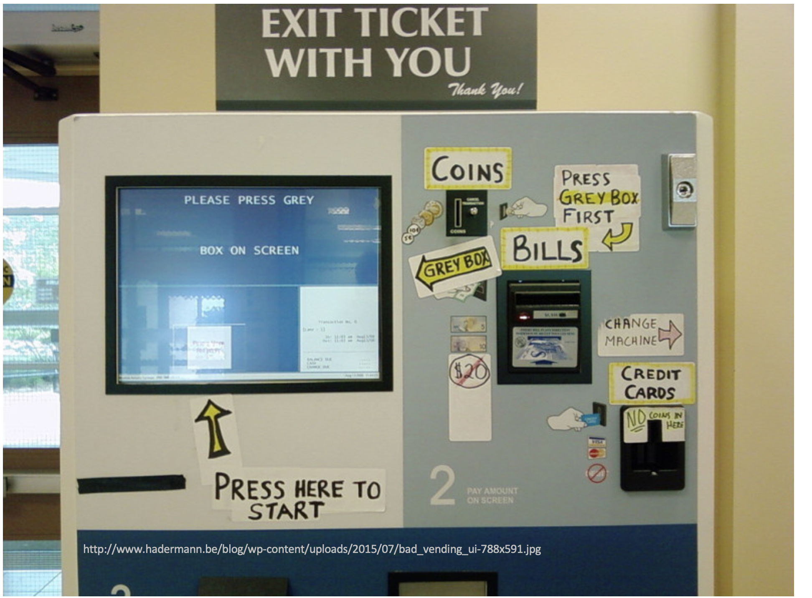
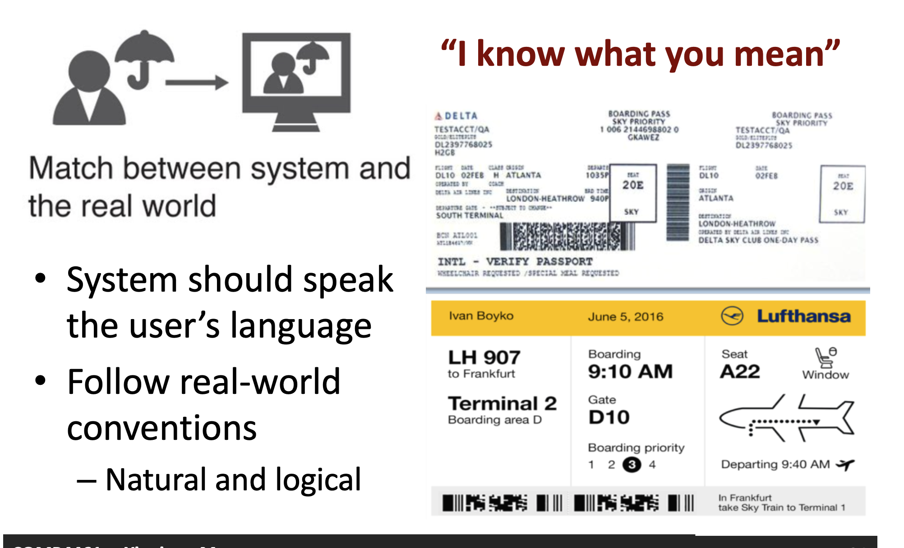
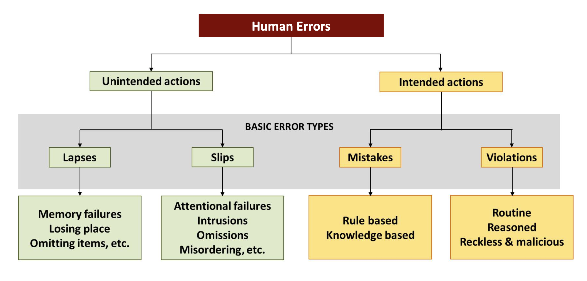

# Comp 4461 Lecture 12 (14/10/2025): Evaluation
[Home Page](../../README.md) | [Previous Lecture](./notes_L11.md) | [Next Lecture]()

- [Comp 4461 Lecture 12 (14/10/2025): Evaluation](#comp-4461-lecture-12-14102025-evaluation)
- [Heuristic Testing](#heuristic-testing)
  - [How to Evaluate your Design?](#how-to-evaluate-your-design)
- [Consistency](#consistency)
  - [Types of Consistency](#types-of-consistency)
- [Mapping](#mapping)
- [Minimalism](#minimalism)
- [Freedom](#freedom)
- [Flexibility](#flexibility)
- [Recognition](#recognition)
- [Visibility](#visibility)
- [Error Prevention](#error-prevention)
  - [Human Errors](#human-errors)
    - [Slips and Lapses](#slips-and-lapses)
- [Error Recovery](#error-recovery)
- [Help](#help)
- [Heuristic Analysis: Cons](#heuristic-analysis-cons)

# Heuristic Testing

Having patches of words means the UI is not intuitive

## How to Evaluate your Design?

- **Heuristic Analysis**
  - "Inspection" Evaluations
  - A principled walkthrough of an interface "by myself"
- **Usability Testing and Controlled Lab Study**
  - Formal method of evaluation that asks (potential) users to complete tasks
- **Field Deployment (e.g., A-B Testing)**
  - Give a prototype to users in the field, and watch their usage/ask for feedback

# Consistency
## Types of Consistency

- **Internal Consistency**
  - Interface consistent with itself
- **External Consistency**
  - Design consistent with similar types of applications/applications on the platform
- **Metaphorical Consistency**
  - Design consistent with the similar real-world entity

- **Principle of Least Surprise**
  - Similar things should act similarly
  - Different things should look different

- **Adhere to Platform Guidelines**
  - Consistent language, color, wording, ordering, ...
  - Consistent use of input syntax

# Mapping

# Minimalism
Remove information that is irrelevant or rarely needed from the design

# Freedom
- Provide clearly marked **“emergency exits”** to leave unwanted states.
- Support **undo**, **redo**, **go back**, **remove**, **exit**, ...

# Flexibility
- "Allow me to do more or less"

# Recognition
- Minimize memory load by making instruction visible or easily achievable

add labels or symbols where necessary (?)

# Visibility
- Keep users informed
- Feedback should be appropriate from users’ perspective
- Feedback should be timely and concrete

# Error Prevention
- Design to prevent errors from occurring
- Eliminate error-prone conditions
- Present users with a confirmation option before they commit to the action
  
## Human Errors

### Slips and Lapses
- **Capture Error**  
  Frequently done activity instead of the intended one.
- **Description Error**  
  Intended action similar to others.
- **Loss of Intention**  
  Forgetting the goal halfway through.
- **Mode Errors**  
  Do actions in one mode thinking they are in another.
- **Omissions due to Interruption**
- **Omissions due to already Satisfied Goal**

How to reduce?
- extra effort will help people think
- disconnect mental associations (train example: put emergency buttons away from the door)

# Error Recovery
> “I know what went wrong, I can fix it”

- Use plain language
- Identify the problem
- Constructively suggest a solution

- Be Informative  
  – Restate or highlight the error
- Be Concrete  
  – Provide suggestion  
  – Give example(s) if needed
- Be Polite

# Help
- Tutorials or get started manuals
- Reference manuals
- Reminders
- Wizards
- Tips

# Heuristic Analysis: Cons

- **Principles are General**  
  – Not a simple checklist  
  – Subtleties involved in use  
  – Potentially irrelevant or out of date  

- **Feedback is Subjective**  
  – Bias  
  – False positives  
  – Experts are not typical users