# Comp 4461 Lecture 3 (9/9/2025)
[Home Page](../../README.md) | [Previous Lecture](./notes_L2.md) | [Next Lecture](./notes_L4.md)

- [Comp 4461 Lecture 3 (9/9/2025)](#comp-4461-lecture-3-992025)
- [Understanding Humans](#understanding-humans)
  - [Human capabilities](#human-capabilities)
  - [Senses - Vision](#senses---vision)
    - [Gestalt Principles](#gestalt-principles)
      - [Design](#design)
      - [Background/foreground](#backgroundforeground)
      - [Grouping](#grouping)
    - [Colour Vision](#colour-vision)
    - [Color Psychology](#color-psychology)
    - [Colour Sensitivity/Deficiency](#colour-sensitivitydeficiency)
    - [Implications of Vision for HCI](#implications-of-vision-for-hci)
  - [Senses - Hearing](#senses---hearing)
    - [Implications for HCI](#implications-for-hci)
  - [Senses - Touch](#senses---touch)
    - [Implications for HCI](#implications-for-hci-1)
  - [Sense - Smell and Taste](#sense---smell-and-taste)
  - [Sense - Motor](#sense---motor)
    - [eye-hand coordination](#eye-hand-coordination)
    - [Fitts's law](#fittss-law)
    - [Interface design](#interface-design)

# Understanding Humans
The human brain and the computer logic is not the same.

e.g.: deleting a file 
- humans: throwing away something 
- computer: marking as removable

We want to make the design intuitive for humans to understand

## Human capabilities
- Senses
  - receive and respond to info via senses

- Memory
  - long and short term

- cognition
  - Attention, learning, problem solving, language, etc.
    – Capabilities influenced by emotion

## Senses - Vision
- Human eyes are only sensible to some range of wavelengths
- Adaptive to different environment -> strain
- Deficiencies: age-related degenetation, short/far sight, colour blindness

FOV: We should put the thing that needs focus near the centre\

  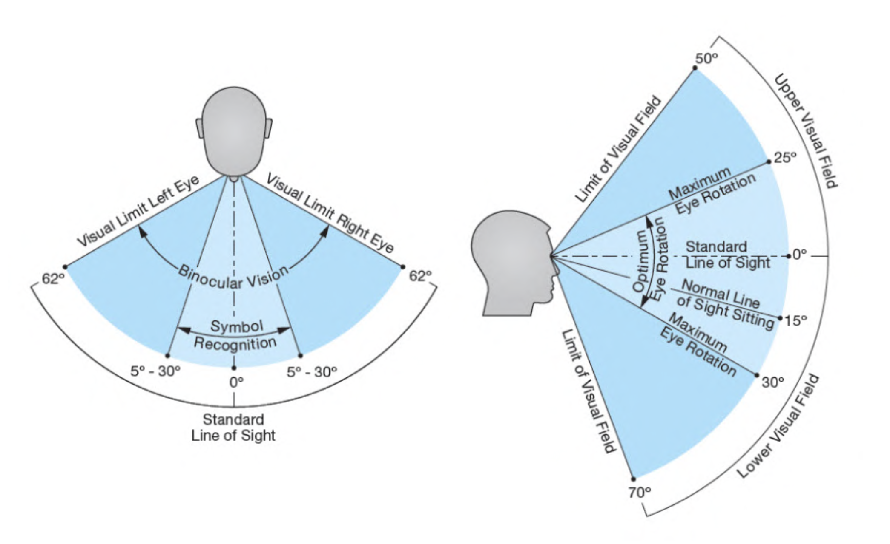

  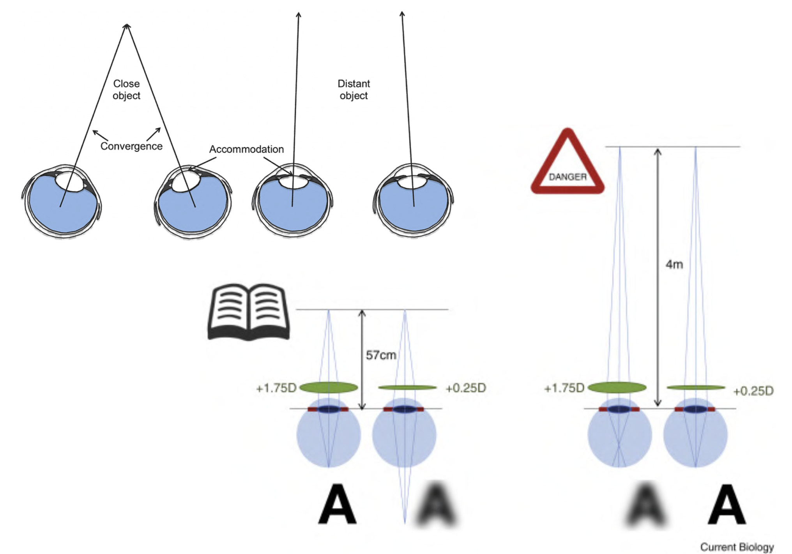

### Gestalt Principles
- principles/laws of human perception that describe how humans group similar elements, recognize patterns, and simplify complex images when we perceive objects.
  
#### Design
- Closure
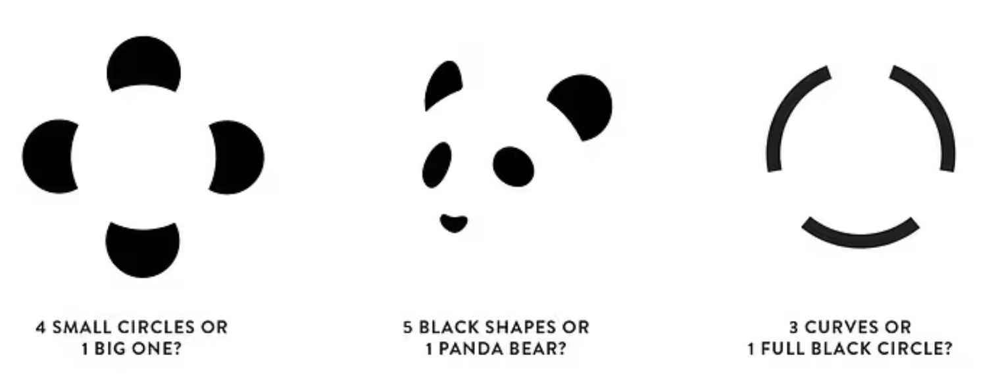
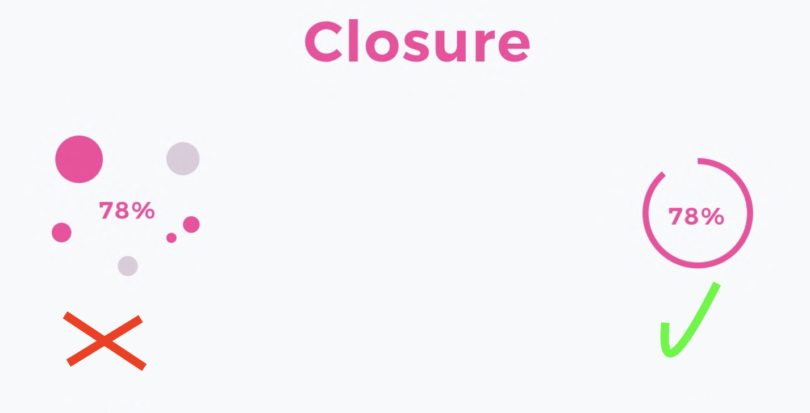

- Continuation
(left applies continuation. (doesn't mean it's necessarilt better ))
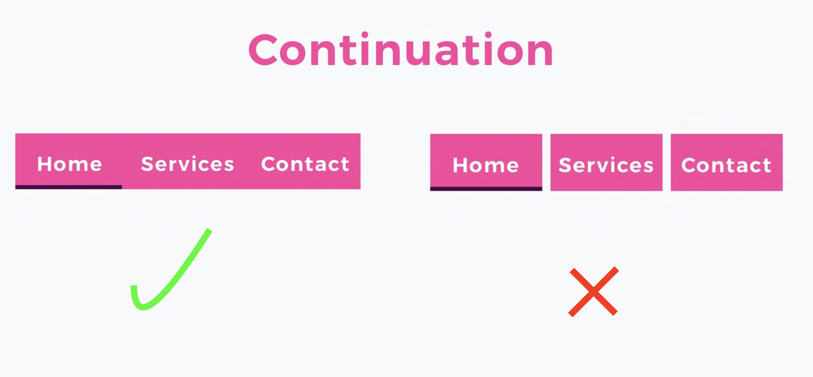

- Common Fate
Things that are moving together (in the same direction) are thought of as a group
  

    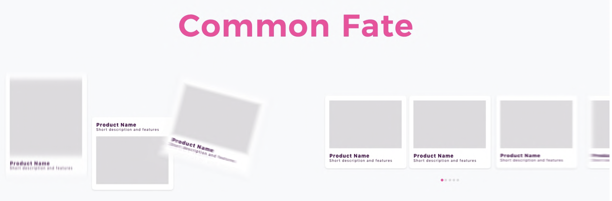
  

  **Another source of common fate is responsiveness/delay**
  - Delay causes people to not associate an action with a consequence

- Symmetry

    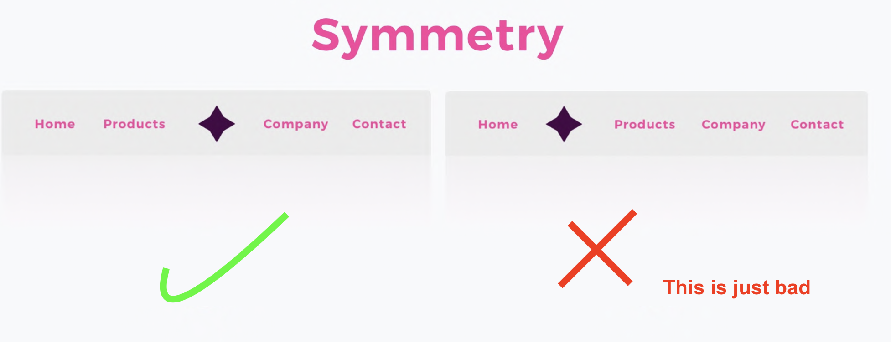

#### Background/foreground
- Figure - Ground\
There may be multiple perceptions of the same image. People may take different parts as the foreground/background. 

  How to differentiate foreground?
  - Usually, the smaller items are the foreground
  - occlusion: item being covered usually considered as background
  - shadow

  

    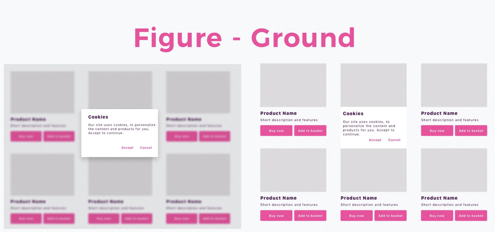
  

#### Grouping

- Similarity\
  things that are of the same colour are of the same group
  

    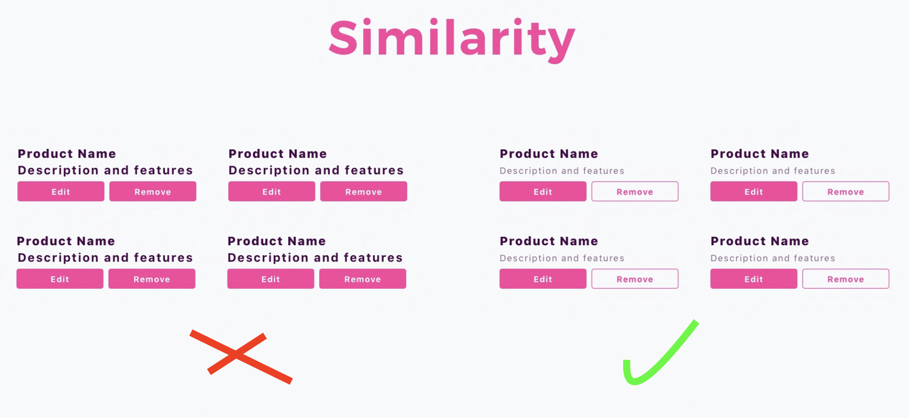
  

- Proximity\
  Group things that are closer to each other as one group

  similarity vs proximity: proximity is a **STRONGER CUE** than similarity

  

    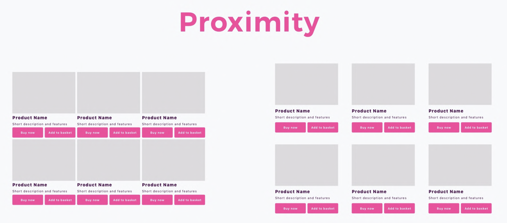
  

- Common Region
  

    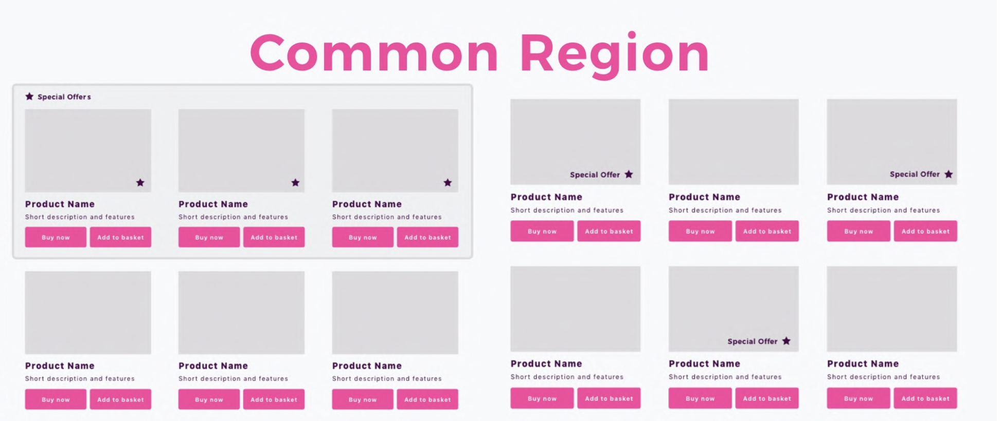
  

### Colour Vision

Humans are most sensitive to green 
> during the day, the sensitivity is more yellow

  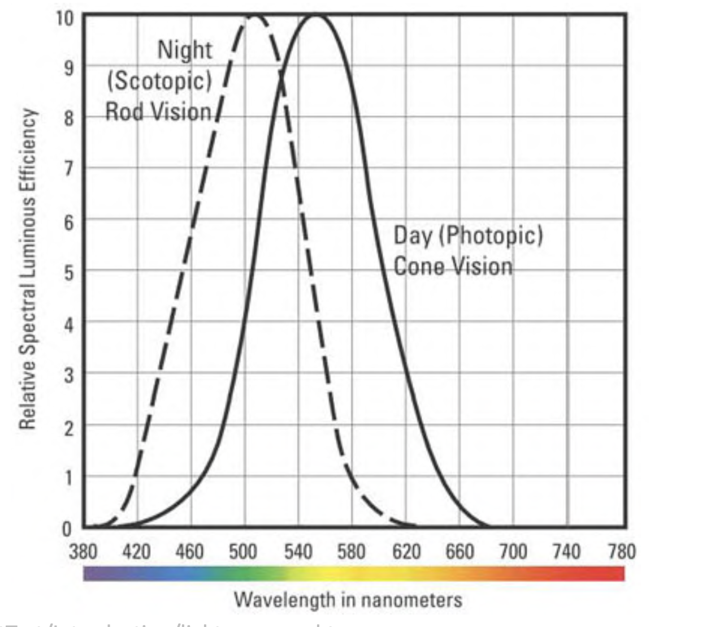

Different envirenment (e.g. lighting) and people may have different perception
  

    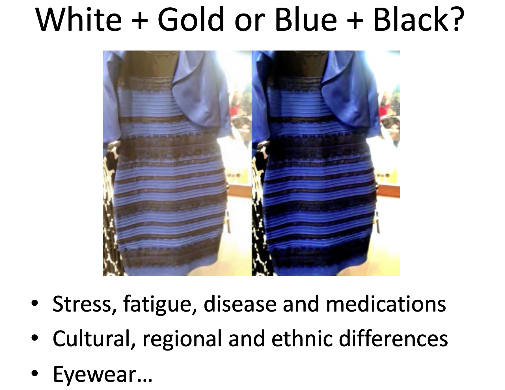
  

### Color Psychology
- Perception of color is affected by surroundings
- colors may be assiciated to emotions
- Stereotypically, certian genders/cultures may favour different colours
- Colours may have psychological effect: blue lights from phones, warm lights to mimic the sun to help people wake up, etc..

### Colour Sensitivity/Deficiency
Some people may not be able to tell similar colours apart

  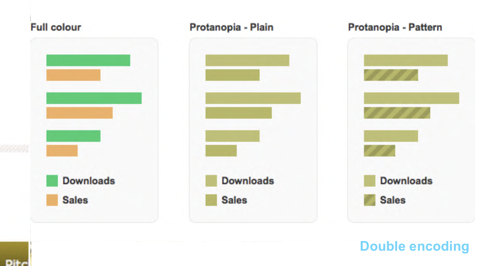

### Implications of Vision for HCI
Processing Fluency affects mental distance
- Aware that people may see the world differently 
- Ensure legibility and accessibility
- Consider characteristics and limitations
- Consider contextual and psychological factors

---

## Senses - Hearing

Capabilities (best-casescenario)
- pitch - frequency (20 - 20,000 Hz)
- loudness - amplitude (30 - 100dB)
- location (5° source & stream separation)
- timbre - type of sound (lots of instruments)

Cocktail Party Effect (ability to pick up cues even when we are not listening for them)
- Selection
- Detection

### Implications for HCI
Our hearing processes speech, music, environmental sounds, and synthesis sounds. These sounds can stimulate preception/emotion

---

## Senses - Touch
Pressure triggers the sense of touch

  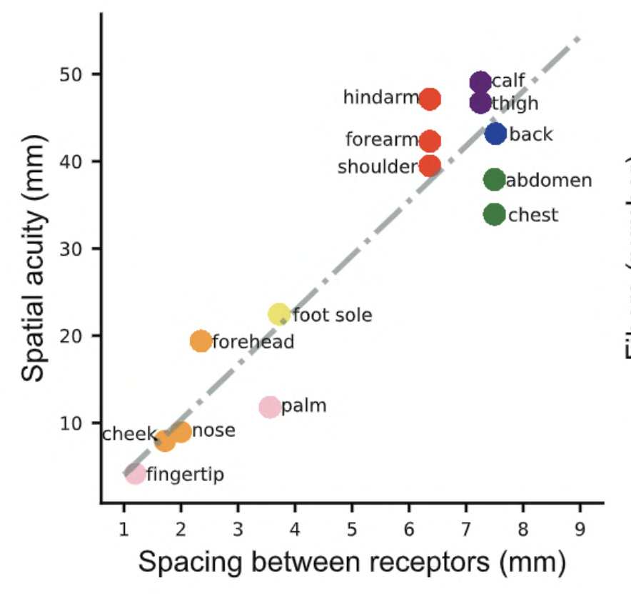

### Implications for HCI
- Use as input
- Use as output
- Fool the skin and muscles

---

## Sense - Smell and Taste
- Less used since it is more intrusive and may not be safe
- The sense of taste can be simulated using electricity

---

## Sense - Motor

- Motion can be used as feedback to humans (e.g. vibration)
- Different people may have different motor abilities:
  - Elderly may not have the dexterity

### eye-hand coordination
e.g. youtube skip-ad button
the countdown was moved to be on the skip ad button

### Fitts's law

  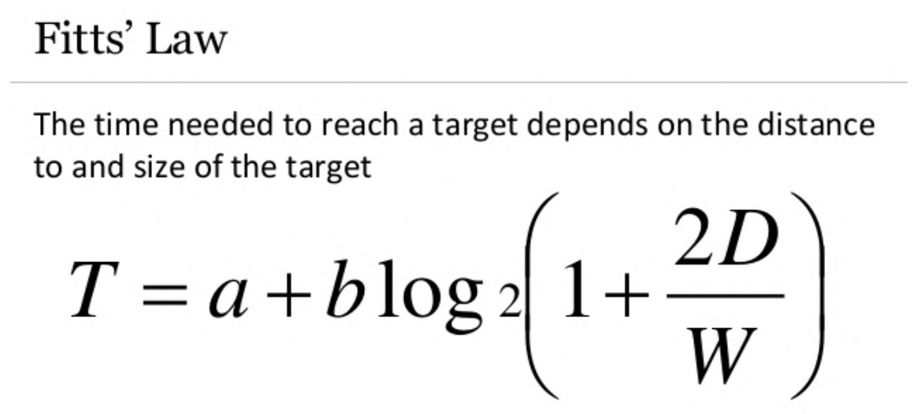

### Interface design

  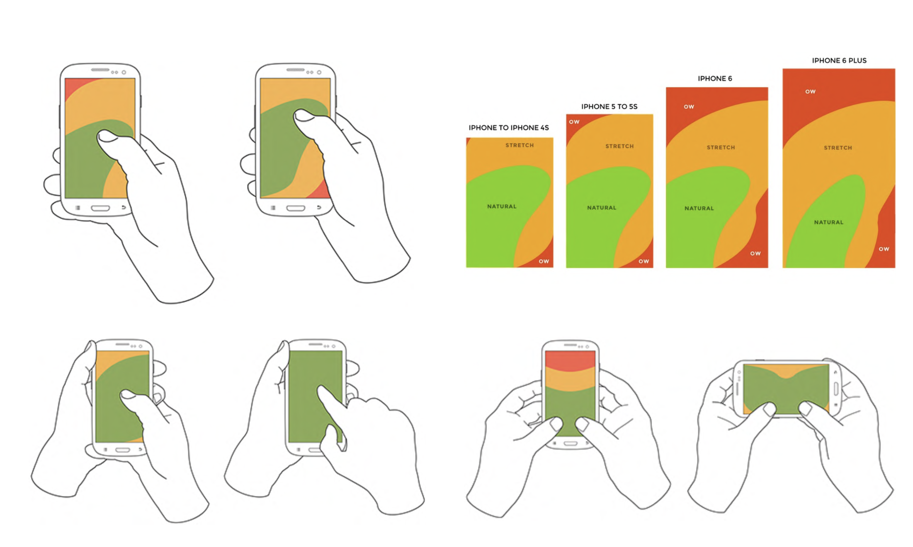

- different keyboard layouts are arranged based on the usage frequency
- the "restart" slider on iphones are on the top of the screen
- numpad for calculators and phones are different