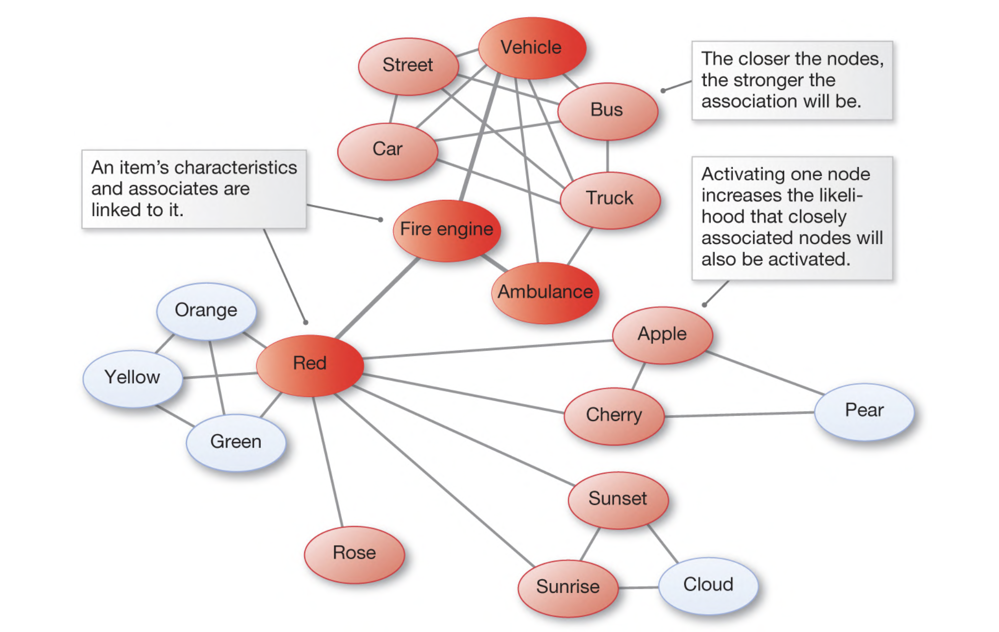
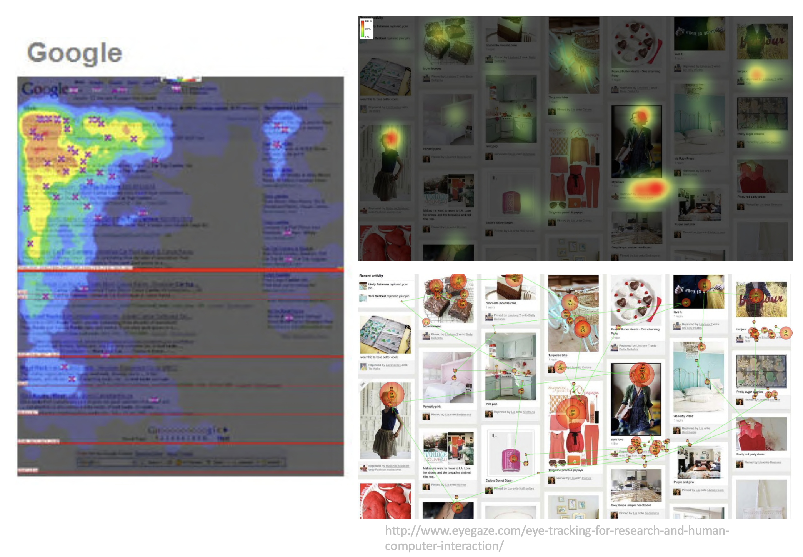
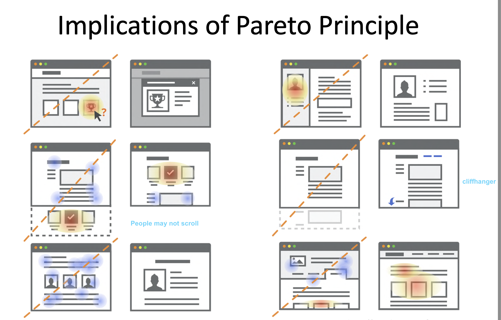
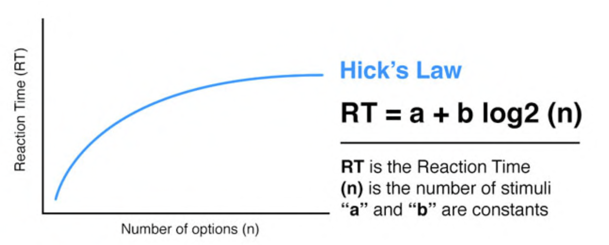
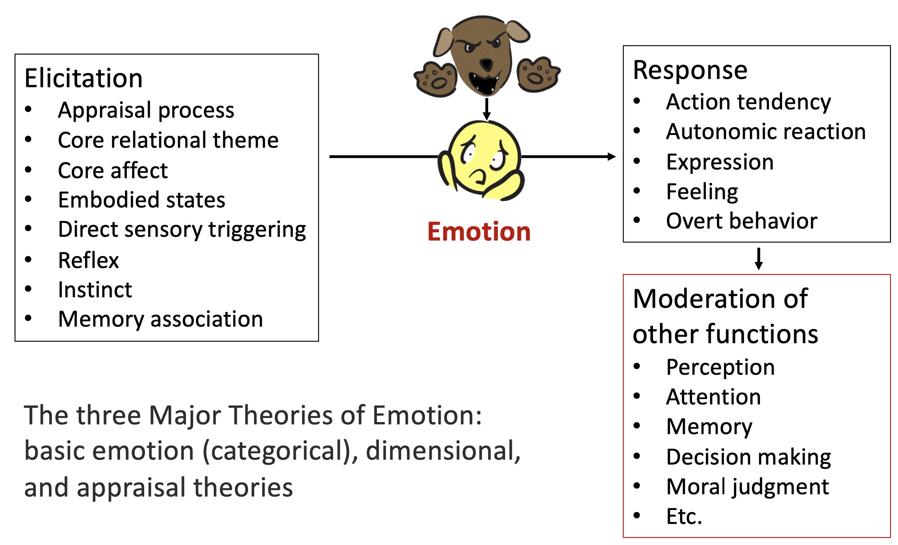
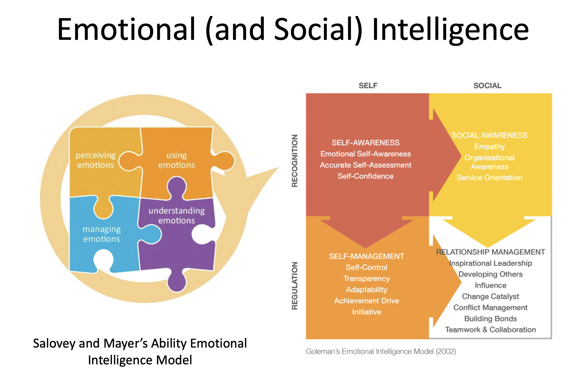

# Comp 4461 Lecture 3 (9/9/2025)
[Home Page](../../README.md) | [Previous Lecture](./notes_L3.md) | [Next Lecture]()

- [Comp 4461 Lecture 3 (9/9/2025)](#comp-4461-lecture-3-992025)
- [Understanding Humans - Memory](#understanding-humans---memory)
  - [Short-term vs. Long-term Memory](#short-term-vs-long-term-memory)
    - [Spread-Activation Theory](#spread-activation-theory)
    - [Hermann Ebbinghaus Law](#hermann-ebbinghaus-law)
    - [Cliffhanger-Effect (Zeigarnik-Effect)](#cliffhanger-effect-zeigarnik-effect)
    - [Self-Reference Effects](#self-reference-effects)
  - [Spatial memory](#spatial-memory)
  - [Memory: Implications for HCI](#memory-implications-for-hci)
- [Understanding Humans - Cognitive Systems](#understanding-humans---cognitive-systems)
  - [Attention](#attention)
    - [Nielsen’s Response Time Limits Law](#nielsens-response-time-limits-law)
    - [Pareto Principle (80-20 Rule)](#pareto-principle-80-20-rule)
    - [Attentional/situational blindness](#attentionalsituational-blindness)
    - [Banner Blindness](#banner-blindness)
  - [Learning](#learning)
    - [Learning on Technology Acceptation: Baby Duck Syndrome](#learning-on-technology-acceptation-baby-duck-syndrome)
    - [Technology-Mediated Learning: Passive Learning](#technology-mediated-learning-passive-learning)
  - [Problem Solving](#problem-solving)
    - [Hick-Hyman’s Law](#hick-hymans-law)
    - [Problem Solving: Implications for HCI](#problem-solving-implications-for-hci)
  - [Language](#language)
    - [Four Design Characteristics of Language](#four-design-characteristics-of-language)
  - [Emotion](#emotion)
    - [Emotion \& Social Intelligence](#emotion--social-intelligence)

# Understanding Humans - Memory
## Short-term vs. Long-term Memory

### Spread-Activation Theory

  

**Priming**: Exposure to a stimulus influences behavior in subsequent, possibly unrelated tasks

### Hermann Ebbinghaus Law

- Serial Position Effect
  - Recall accuracy is a function of the position in the list
- Recency Effect
  - The latest item 
- Primacy Effect
  - The first few items

### Cliffhanger-Effect (Zeigarnik-Effect)
People remember unfinished or interrupted tasks better than completed

### Self-Reference Effects
Things related to self are easier to remember (e.g. phone number, bdays)

## Spatial memory
Location, Orientation, Navigation

e.g. keyboards

people have a good idea of where their own bodies are

## Memory: Implications for HCI
- Practice and use in context help
  - Recall things “forgotten” due to decay & Interference 
  - Priming: spread-activation
- Make use of familiarity, habit, etc.
  - Enhance learnability

# Understanding Humans - Cognitive Systems

Human attention is dwindling
- this has to do with technology. Smarthphones tunes people to spend time in a fragmented manner

## Attention
### Nielsen’s Response Time Limits Law
- 0.1 seconds: feeling of instantaneous response
  - Good for direct manipulation
- 1 second: keeps the flow of thought seamless
  - OK for navigation
- 10 seconds: keeps the user’s attention, but – Often makes users leave immediately
- Have a sense of incapability
- Unpleasant

### Pareto Principle (80-20 Rule)

since our attention is so short, we will move on very quicky.

20% of the information given will be used to perceve 80% of people's understanding

  

  

### Attentional/situational blindness

> "Inability to see something that that is visibly there"

> "It is easy to miss something we are not looking for"

### Banner Blindness

people learn to ignore things like ADs by learning where they commonly are 

## Learning
- two types: 
  - Procedural (how to do something)
  - Declarative (facts about sth)
- Facilitated by
  - Analogy
  - Structure & organization 
  - incremental units
  - Repetition
- Hindered by
  - Previous knowledge (move from Mac to Windows)
  - Personal belief

### Learning on Technology Acceptation: Baby Duck Syndrome
tendency of a user to compate each new computer system to what they originally learned
> not-familiar -> negative

A baby who learned to use tablets was confused by a magazine

### Technology-Mediated Learning: Passive Learning
Poeple may learn without actively learning 

e.g. via haptics ([youtube](https://www.youtube.com/watch?v=t5L8KDfNENo))

## Problem Solving
- Deductive
  - If A, then B
  - “Select before copy” – provide hints
- Inductive
  - Generalizing from previous cases, knowledge transfer
  - “Also select before cut” – put similar things together
- Abductive
  - Reasons from a fact to the causal action or state
  - “grey out paste” – direct interpretation

### Hick-Hyman’s Law
- The more options, the harder (longer time) to decide
  

    
  

- A default option has a higher likelihood to be chosen

### Problem Solving: Implications for HCI

People: 
- More Heuristics than algorithmic
- Choose suboptimal strategy for low priority task
- Learn better strategies through practices

Implications
- Use common template 
- Provide clear cues (e.g. changing mouse pointer)
- Follow consistent path

## Language
(Natural) Language
- The method of human communication, either spoken or written (or manual / signed), consisting of the use of words in a structured and conventional way

Language ability is acquired. The usage is situational

### Four Design Characteristics of Language

1. Language should be clear
   - Clarity is a consistent “one-to-one mapping between underlying semantic structures and surface forms,” but all natural languages have inconsistencies.
      - Lexical ambiguity (same word, diff meaning)
      - syntatic ambuiguity (same sentence/phrase, different meaning)
2. Language should be quick and easy
   - Language is often simplified through abbreviation or other shortening, obtaining efficiency at the expense of learnability, regularity or even clarity
3. Language should be expressive
   - > ... to communicate effectively, engagingly, appropriately ... to direct the listener’s attention
   - The diversity of language has decreased, which may be due to the use of internet slang
4. Language should be processible
   - The rate at which the speaker and listener can accurately encode and decode language utterances must be comparable
     - People may have different pronounciations 
   - If they proceeded at rates that were too discrepant or led to too much error, communication would suffer
     - Aphasia: language impairment caused by brain injuries

## Emotion
Helps modulate a lot of our other functions

  

> [!note] See Lecture notes for models of emotions

- **James-Lange Theory of Emotion**
  - Physiological theories suggest that responses within the body are responsible for emotions.
- **Schachter-Singer (Two Factor) Theory of Emotion**
  - Cognitive theories argue that thoughts and other mental activity play an essential role in forming emotions.
- **Cannon-Bard Theory of Emotion**
  - Neurological theories propose that activity within the brain leads to emotional responses.

### Emotion & Social Intelligence

  

