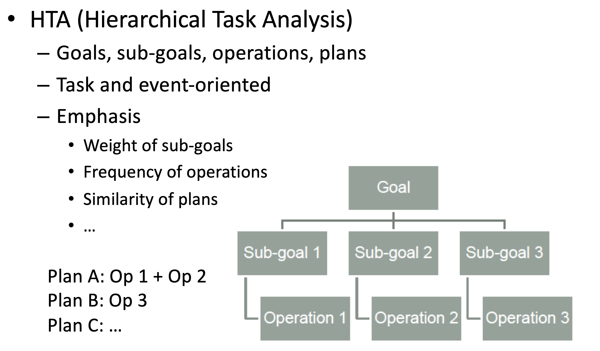
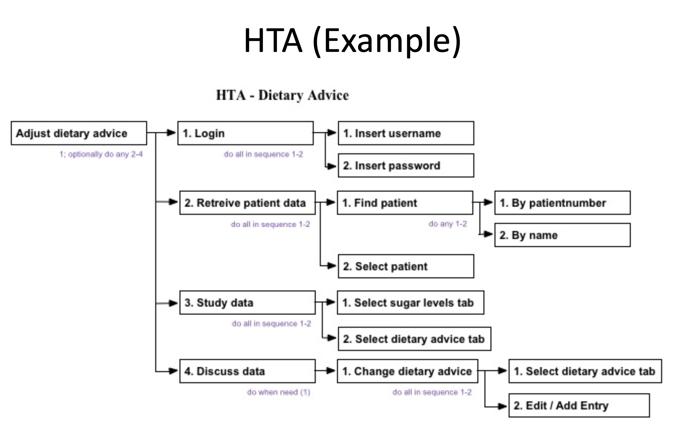
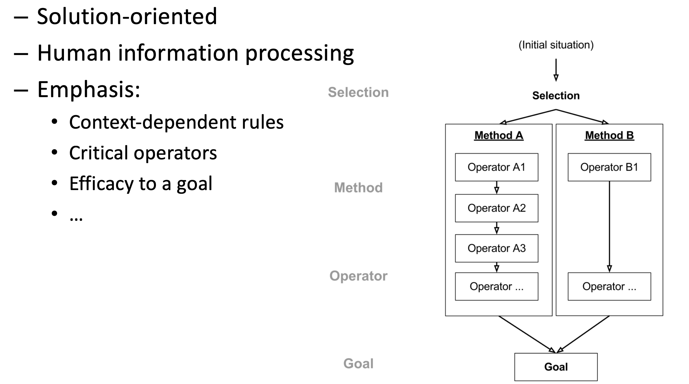
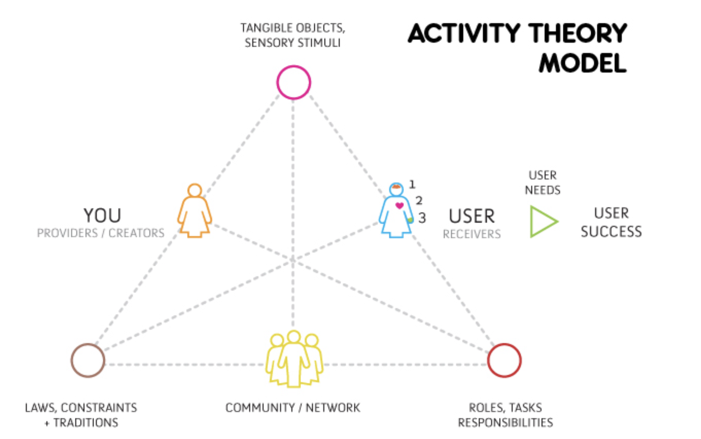
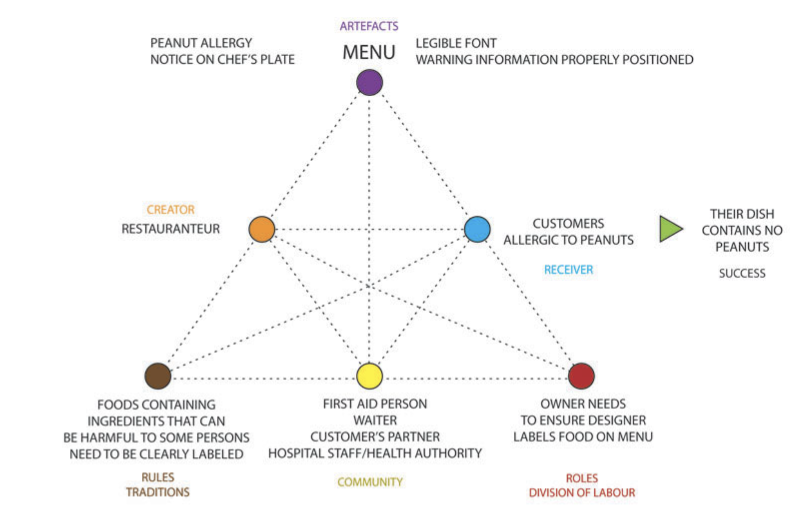
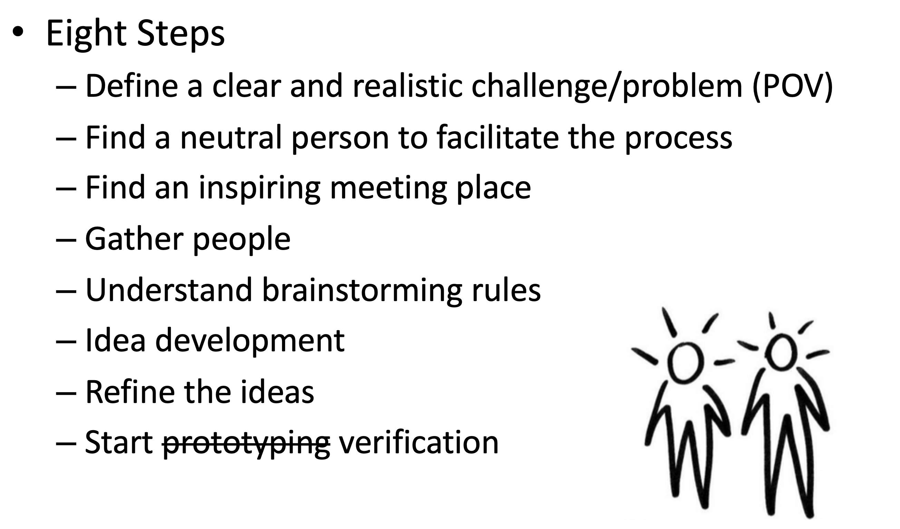
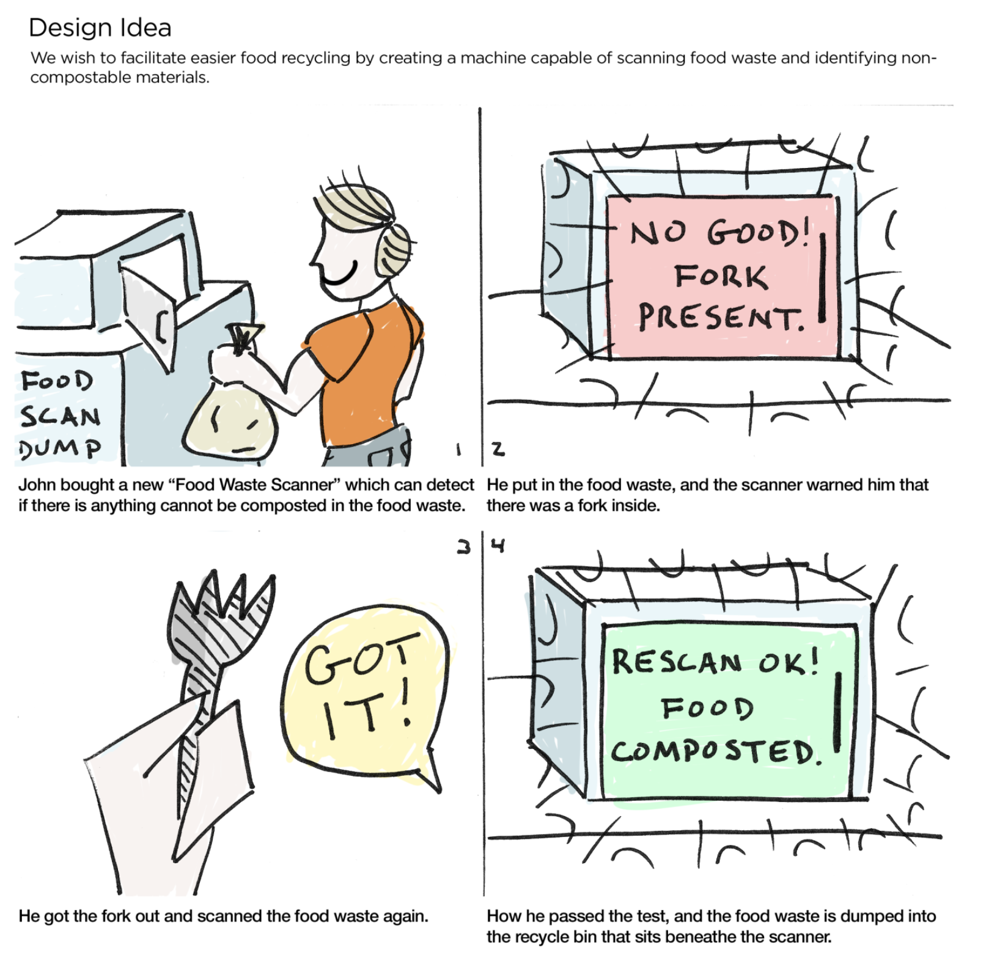

# Comp 4461 Lecture 6 (18/9/2025)
[Home Page](../../README.md) | [Previous Lecture](./notes_L5.md) | [Next Lecture]()

- [Comp 4461 Lecture 6 (18/9/2025)](#comp-4461-lecture-6-1892025)
- [Interpret](#interpret)
  - [organise](#organise)
  - [Construct a Framework](#construct-a-framework)
    - [Hierachical Task Analysis](#hierachical-task-analysis)
    - [GOMS (Goals,Operators,Methods,andSelectionrules)](#goms-goalsoperatorsmethodsandselectionrules)
    - [Activity Theory](#activity-theory)
  - [From Framework to Need](#from-framework-to-need)
    - [Generate Point-of-View(PoV)](#generate-point-of-viewpov)
    - [POV User: Create Persona](#pov-user-create-persona)
    - [POV Need: Ideals and Constraints](#pov-need-ideals-and-constraints)
- [Ideation](#ideation)
  - [Brainstorming](#brainstorming)
    - [Steps](#steps)
    - [Rules](#rules)
    - [Tools](#tools)
  - [Verification](#verification)
    - [Storyboarding](#storyboarding)
    - [Speed Dating](#speed-dating)
    - [Advanced Speed Dating: Role Playing](#advanced-speed-dating-role-playing)

# Interpret

## organise
transcribe all materials to text, add anontations

Group into necessary clusters:
- Themes 
- Patterns 
- Trends

## Construct a Framework
### Hierachical Task Analysis

  
  

### GOMS (Goals,Operators,Methods,andSelectionrules)

Make comparisons of different things poeple have done

  

### Activity Theory

  
  

## From Framework to Need

- Identify goal(s) / sub-goal(s) that are not met
- Identify the weak link(s) or bottleneck(s) in the operations and methods
- Identify the user groups cannot benefit from the existing (best) solutions
- Identify the problems in the selection process (e.g., cost, accessibility, etc.)
- ...

### Generate Point-of-View(PoV)
POV = User + Need + Insight (Goal)
> [a user] needs a way to [do something] to [achieve a goal]

### POV User: Create Persona
- description of a "fake" user

| Demographics | Attributes | Goals
|  --- | --- | ---
| - Background | - Abilities | - Details
| - Bio | - Likes/dislikes| - Reasons

### POV Need: Ideals and Constraints

- User needs to ... 
- User wants to ... 
- User do not...
- User cannot ...

# Ideation
- Interpret the POV
- Broaden the Scopes
- Conceptualize the Designs

## Brainstorming
### Steps

  

### Rules
- “Yes, and” instead of “No / But”
- Communicate, and inspired by others
- Go visual
- Quantity makes Quality

### Tools
- Whiteboard
- sticky-note
- Lego Blocks
- Mind Map (this is what we will be using)\
  https://www.mindmup.com/

## Verification
### Storyboarding

  

We can use swiggles if we don't know how to draw

### Speed Dating

Rapid Interviews with Potential Users
- Purpose:
  - Verify your interpretation 
  - Needfinding
- Instrument: storyboard
- Process:
  - Warm-up (know the user) 
  - Interpret the storyboard
  - Similar problem in life?
  - If yes, why and how?
  - If no, what is the problem? 
  - Existing solution?
  - Things to add

### Advanced Speed Dating: Role Playing

---