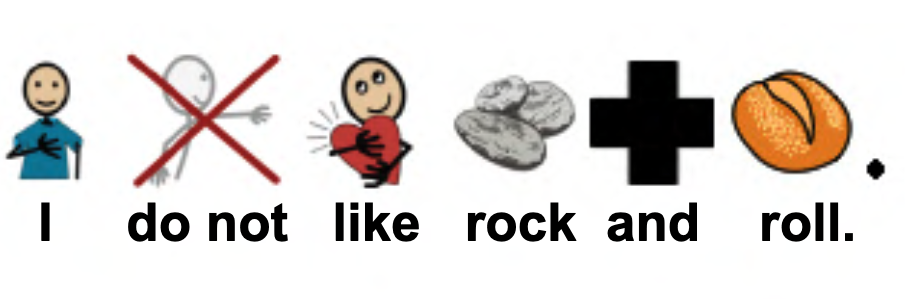
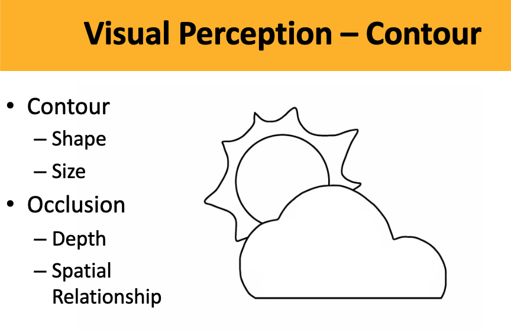
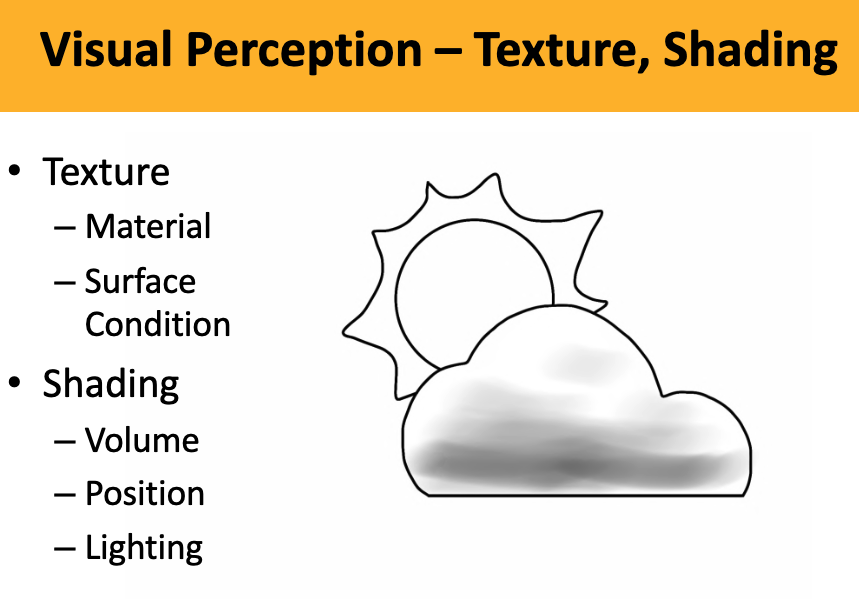
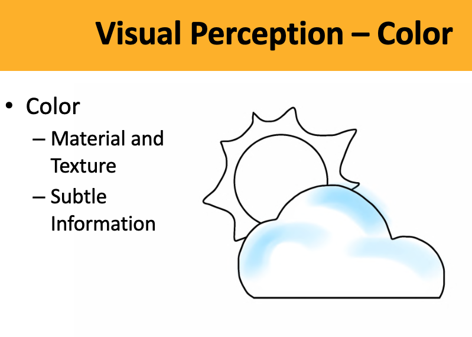
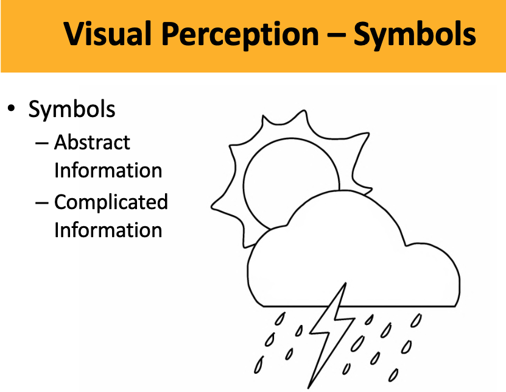
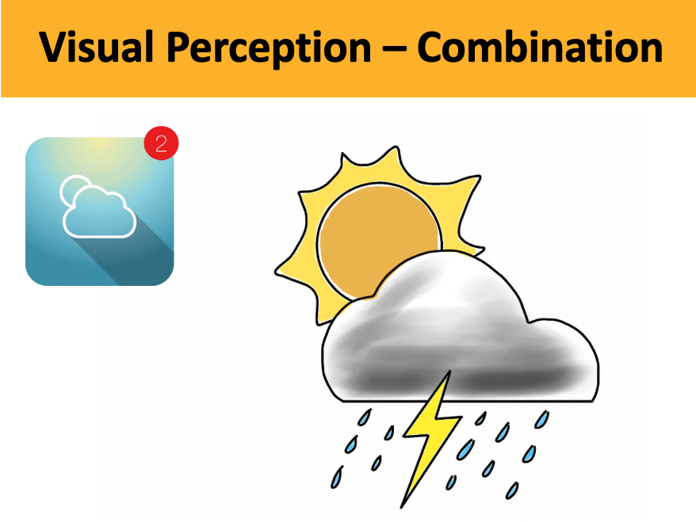
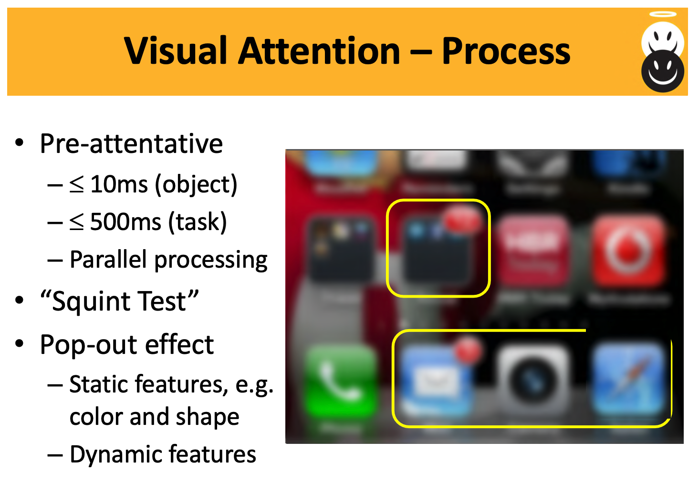
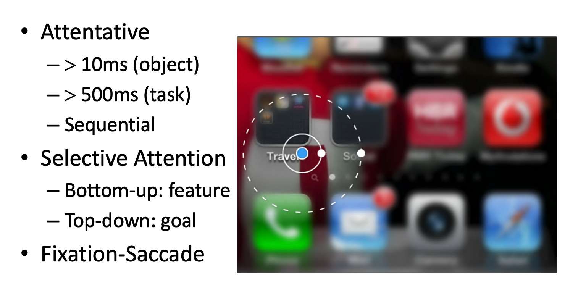

# Comp 4461 Lecture 7 (23/9/2025)
[Home Page](../../README.md) | [Previous Lecture](./notes_L6.md) | [Next Lecture](./notes_L8.md)

- [Comp 4461 Lecture 7 (23/9/2025)](#comp-4461-lecture-7-2392025)
- [Visual Interaction and HCI](#visual-interaction-and-hci)
  - [What is good about Visual Communication?](#what-is-good-about-visual-communication)
  - [Limitations of Visual Communication](#limitations-of-visual-communication)
  - [interpretation of visual stimulus](#interpretation-of-visual-stimulus)
  - [Visual perception](#visual-perception)
  - [Visual attention](#visual-attention)

# Visual Interaction and HCI
- conveys information to the users
- disabilities
- when people don't have time to read text

## What is good about Visual Communication?
Task Performance
- Efficiency
- Accuracy

User Experiences
- Physical
- Psychological

## Limitations of Visual Communication
- Ambiguity
- Non-imageable Concepts
- Sensitivity to Individual Differences

## interpretation of visual stimulus
The interpretation of a visual stimulus depends on
- context 
- age, culture

## Visual perception

the icon on the left: the color of the background and the shapes suggests different locations of the sun

## Visual attention

