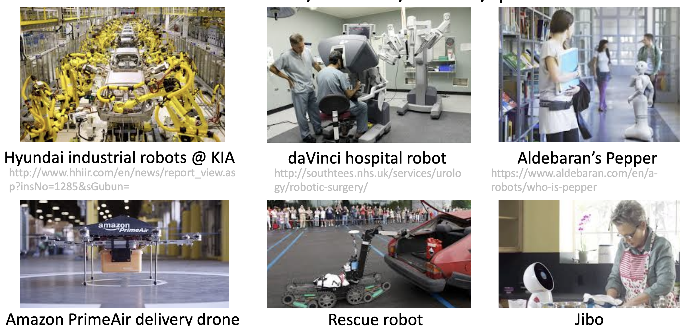
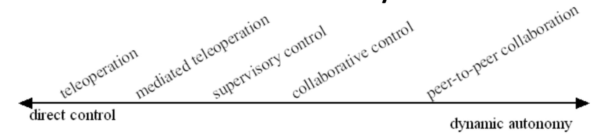
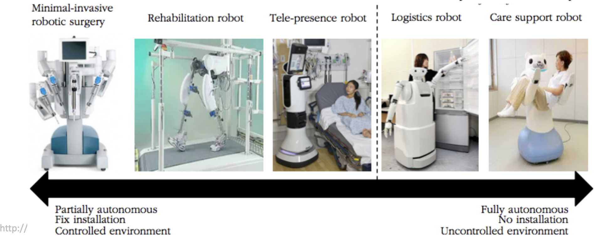
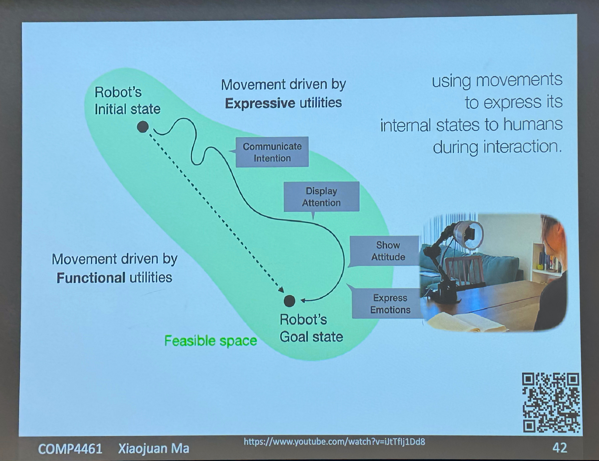
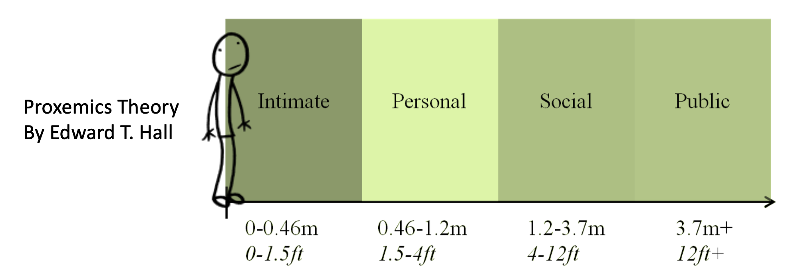
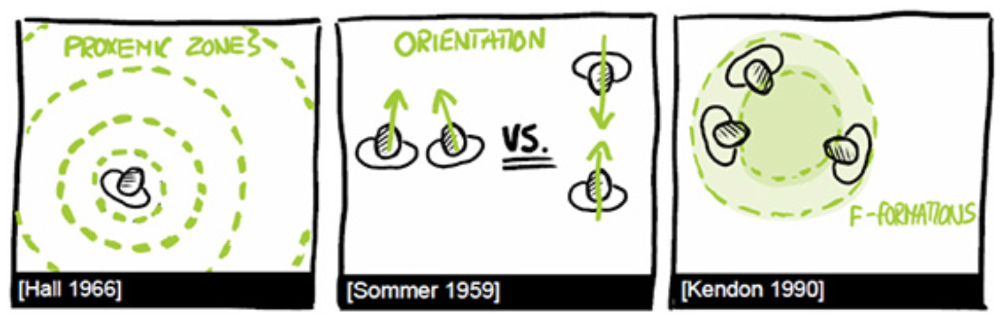
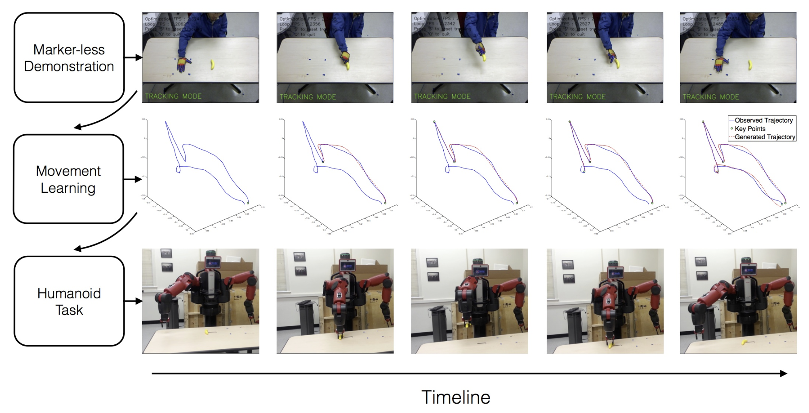

# Comp 4461 Lecture 8 (25/9/2025): Human Robot Interaction
[Home Page](../../README.md) | [Previous Lecture](./notes_L7.md) | [Next Lecture]()

- [Comp 4461 Lecture 8 (25/9/2025): Human Robot Interaction](#comp-4461-lecture-8-2592025-human-robot-interaction)
- [Types of robots](#types-of-robots)
- [Are we ready to live with robots?](#are-we-ready-to-live-with-robots)
- [How humans view robots?](#how-humans-view-robots)
- [Level of Autonomy in HRI:](#level-of-autonomy-in-hri)
- [Human-Robot Interaction](#human-robot-interaction)
- [Interaction Design](#interaction-design)
  - [Perception Pipeline](#perception-pipeline)
    - [Pipeline Steps](#pipeline-steps)
    - [Target](#target)
    - [Inference (Recognition \& Prediction)](#inference-recognition--prediction)
      - [Challenges with Data/Features](#challenges-with-datafeatures)
    - [Motion (Shadow Robot Hand Grasping and Hand-over)](#motion-shadow-robot-hand-grasping-and-hand-over)
    - [Intention (by Prof. Anca Dragan from UC Berkeley)](#intention-by-prof-anca-dragan-from-uc-berkeley)
- [Social Interaction Design](#social-interaction-design)
  - [Facial Expression](#facial-expression)
  - [Bodily Expression](#bodily-expression)
  - [Gaze](#gaze)
  - [Proxemics](#proxemics)
  - [Personal Space](#personal-space)
    - [Characteristics of Personal Space](#characteristics-of-personal-space)
  - [Proxemics and Personal Space (Ameca)](#proxemics-and-personal-space-ameca)
  - [Implications for HRI](#implications-for-hri)
- [Intelligence Design](#intelligence-design)
  - [Learnability](#learnability)
  - [Curiosity](#curiosity)
  - [Empathy](#empathy)
    - [Theory of Mind (ToM) and Empathy](#theory-of-mind-tom-and-empathy)
  - [Ethics](#ethics)
    - [Three Laws of Robotics – No harm to human](#three-laws-of-robotics--no-harm-to-human)
- [Recap](#recap)

# Types of robots
- Virtual Robots (Agent or Avatar)
  - Spider, e.g. Googlebot
  - Chatbot
  - Intelligent Personal Assistant, e.g. Siri:
- Physcial Robot
  - appearance: machine, vehicle, animal, humanoid
  - function: industrial, service, social/personal\
    

# Are we ready to live with robots?
- Humans and robots cannot predict each other
- we may create an illusion of trust -- an illusion that a robot is a human
- Three laws of robotics:
  - A robot may not injure a human being or, through inaction, allow a human being to come to harm.
  - A robot must obey the orders given it by human beings except where such orders would conflict with the First Law.
  - A robot must protect its own existence as long as such protection does not conflict with the First or Second Law.

# How humans view robots? 
- tool?
  - e.g. exoskeleton: tool to help poeple move
- (social) actor?
  - e.g. humanoid robots

This mindset can shift when interacting with the same robot:
- e.g. Bank of America's ATM with a virtual teller
- e.g. CMU Roboceptionist: Actor to Tool
  - people first tried to talk (**actor**) but find out they need to type and need to use a specific format -> they shift to looking at the robot as a **tool** instead
- e.g. Rock-paper-scissors robot
  - people first thought of it as **actor** playing the game -> then they become bored and think of the robot as being just programmed to give random results (**tool**) -> researchers ask the robot to "cheat" => people think of the robot as an **actor** again

# Level of Autonomy in HRI:

| |
| :---: |
|  |
| Robots in hospital setting |

# Human-Robot Interaction
- Social Intelligence

|  |  |  |
| --- | --- | --- |
| Help seeking | Resolution of conflict | Consultation
| Apology | Resolution of challenge  | Persuasion
| Refusal | Resolution of abuse | Recommendation
| Humor | | Collaboration |

- Interaction Design
  - **Low-level Perception**
    - Gaze
    - Facial expression
    - Gesture
    - Speech
    - Proxemics
  - **High-level Perception**
    - Attention and engagement
    - Intention
  - **Manipulation**
    - Shared autonomy
    - Situational awareness

- Intelligence (IQ) Design
  - **Mental Models**
    - Perspective-taking
    - Decision-making
    - Learning

- Social Intelligence and Emotional Intelligence (EQ)

# Interaction Design
| |
| :---: |
|  |
| Uncanny Valley |

## Perception Pipeline

- **The classical approach:** a serial pipeline
- **Weak link analysis:** each step depends on predecessors

### Pipeline Steps
- Sensing
- Pre-processing
- Modeling
- Interpretation

### Target
- Self
- Other participant(s)
- Environment

### Inference (Recognition & Prediction)
information -> human intention -> robot reaction

Humans have our own perception of the robots' sensing abilities

#### Challenges with Data/Features

- **Data/Features must:**
  - Provide sufficient density
  - Match across small viewpoint changes
  - Match across partial occlusions
  - Identify confidence

- **Data/Features must not:**
  - Trigger false positive matches or bias
  - Prove too sparse for the robot's task
  - Require on-line human tuning

### Motion (Shadow Robot Hand Grasping and Hand-over)
- how to hold an object firmly without breaking it
- when to let go of an object?
  - too long -> fighting
  - too short -> drop
- which position to hold the object?

### Intention (by Prof. Anca Dragan from UC Berkeley)
Make the robot look like it is trying to do something
- grabbing one of two bottles: use a detour to show which bottle it is intending to grab

# Social Interaction Design
- Emotional connection with human (OKAERI)
- Social skills to avoid awkward moments (Sophia)
- Emotionally sentient robot/agent
  - how to collect data respectfully so people are willing to share
  - socially: when is the system on? when is the system collecting data?
  - how to not mislead poeple to believeing that the system is smarter than it actually is (people may think the robot is smarter than it actually is)

## Facial Expression

- **Facial Action Coding System (by Ekman)**
  - Evaluate muscular activity (action units) that produces changes in facial appearance
    - Appearance changes
    - Performance
    - Intensity scoring
  - Catalog combinations to afford emotional expression

## Bodily Expression
- Gesture
  - e.g. autonomous vehicles detect people's intentions from their gestures
- Posture & orientation
- Body languages
- Head movement
- Touch
- Space

## Gaze

- **Useful for establishing mutual attention**
  - Look at participants to maintain engagement
  - Follow pointing gestures
  - Define social roles

- **Vary gaze to emphasize semantic information**
  - **Theme**
    - Set the tone
    - Connect to previous utterance
    - Mostly look away
  - **Rheme**
    - New information
    - Gaze returns

## Proxemics
- **Autonomous cars**: heavy braking vs gradual braking
- **Roombas**: Navigation and Proxemics

- **Research Topics**
  - Totally safe obstacle detection
  - Human-body spatial interaction
  - Arms and gesture recognition
  - Human-designed environment engagement

- **Inference Methods**
  - From world knowledge / logical reasoning
  - From camera parameters
  - From disparity / matching

## Personal Space

### Characteristics of Personal Space
- Feel uncomfortable if others within personal space
  - "egg-shaped", with more space in front with more space in front
- Exact size is determined by the following factors:
  - Interpersonal Relationships
  - Gender
  - Culture (Lewis Model of Cultural Types)
    - Cool and decisive (US, Germany)
    - Accommodating and non-confrontational (China, Japan)
    - Warm and impulsive Warm and impulsive (Italy, Mexico)

## Proxemics and Personal Space (Ameca)
- how to 

## Implications for HRI
- One method people have for dealing with violated personal space is dehumanization – treating the intruder as inanimate
- Follow culturally determined conventions that guide a robot’s movement through (peopled) space
  - Approaching
  - Passing by (in corridor / through narrow space)
  - Riding elevator
  - Waiting in line

# Intelligence Design
What is an intelligent robot?
## Learnability
Ability to gather new knowledge

- Learning in HRI
  - Unsupervised Learning
  - Supervised Learning
  - Reinforcement Learning
  - Learning from Demonstration (Imitation Learning) 
  - Transfer Learning
  
## Curiosity
Ability to find questions

- **Learning from Demonstration**
  - demo to robots\
  
    e.g. robot learing from a chef

- **Transfer Learning**: learn based on knowledge from another task
  - Knowledge Transfer in the Internet of Robot
    - A shared world model 
    - A common language 
    - Communication
    - Storage

- **What does AI Learn Actually?**
  - "Garbage in, garbage out"
  - Statistical correlation or true causality? 
    - Noise, biases, etc.
    - Malicious hacks

## Empathy
Ability to build self and other awareness

### Theory of Mind (ToM) and Empathy
> "ToM: An ability – which may or may not be unique to human beings – to explain and predict the actions, both of oneself, and of other intelligent agents" 
> 
> (Carruthers& Smith, 1996, p. 19; Premack& Woodruff, 1978)

## Ethics

### Three Laws of Robotics – No harm to human
- Obey order, except...
- Protect self, as long as...

# Recap

- **Types of robots**
- **Humans’ view of robots**
  - Tool
  - Actor
- **Human-Robot Interaction**
  - Interaction Design
  - Social Interaction Design
  - Intelligence Design
  - Discussion