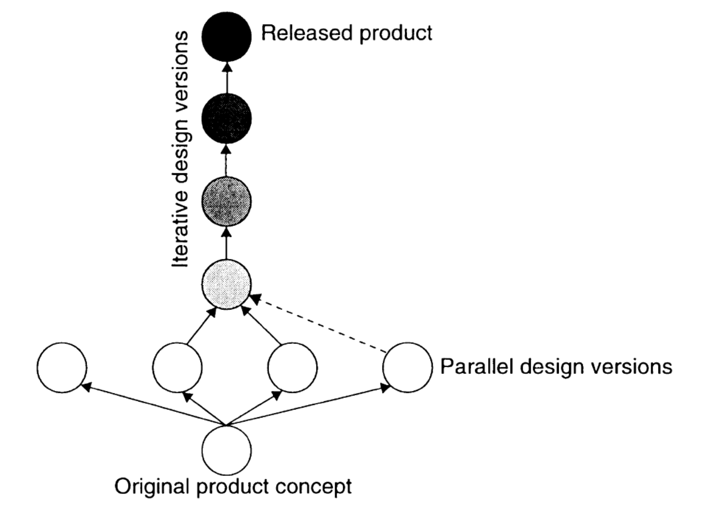
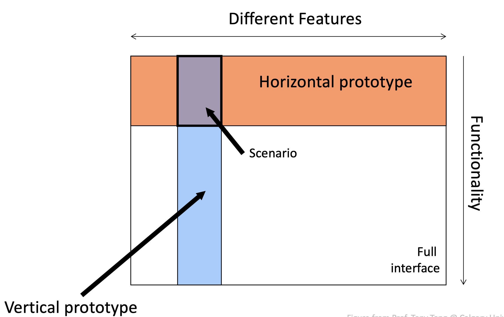
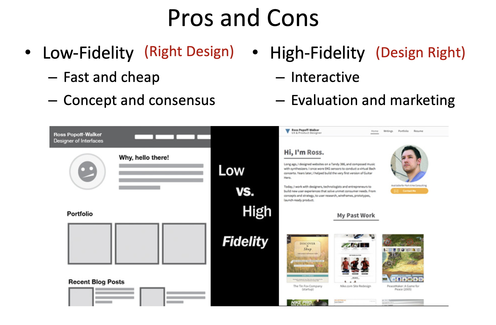
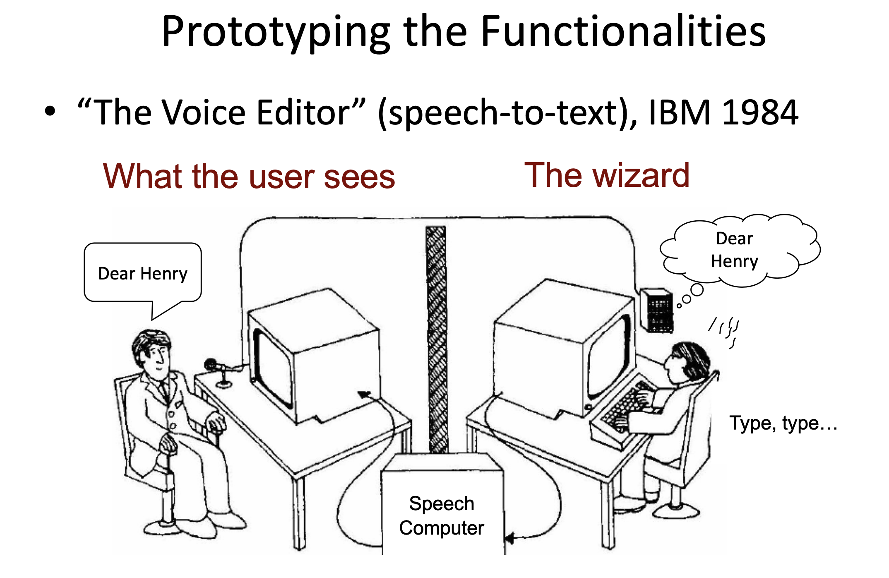

# Comp 4461 Lecture 9 (30/9/2025): Prototyping
[Home Page](../../README.md) | [Previous Lecture](./notes_L8.md) | [Next Lecture](./notes_L10.md)

- [Comp 4461 Lecture 9 (30/9/2025): Prototyping](#comp-4461-lecture-9-3092025-prototyping)
- [Prototyping Process](#prototyping-process)
  - [Serial vs. Parallel Prototyping](#serial-vs-parallel-prototyping)
  - [Horizontal vs. Vertical Prototyping](#horizontal-vs-vertical-prototyping)
  - [What to be prototyped](#what-to-be-prototyped)
  - [Types of prototypes](#types-of-prototypes)
  - [Which Prototyping Method to Use?](#which-prototyping-method-to-use)
  - [Low-Fidelity Prototypes](#low-fidelity-prototypes)
  - [High-Fidelity Prototypes](#high-fidelity-prototypes)
- [low fidelity](#low-fidelity)
  - [Sketch Prototype](#sketch-prototype)
  - [Paper Prototyping](#paper-prototyping)
- [Medium fidelity](#medium-fidelity)
  - [On-Screen Interactive Wireframe](#on-screen-interactive-wireframe)
- [High filfelity](#high-filfelity)
- [Prototyping the Hardware](#prototyping-the-hardware)
- [Prototyping the Functionalities](#prototyping-the-functionalities)
  - ["Wizard of Oz" method](#wizard-of-oz-method)
  - ["Artificial" intelligence](#artificial-intelligence)
- [Prototyping the Experience](#prototyping-the-experience)
  - [Video Prototyping](#video-prototyping)

# Prototyping Process
## Serial vs. Parallel Prototyping
- Serial: depth-first
- Parallel: breadth/diversity-first
  - let people try all the solutions first, then eliminate the ones not wanted

## Horizontal vs. Vertical Prototyping

- Range of capabilities of a single design
- Horizontal: wide range of features without full “implementation” of any
- Vertical: selected feature(s) are “implemented” all the way through

## What to be prototyped
- Task Design and User Flow
  - Based on expected tasks, what will the users see and what will they do?

- Layouts and Content
  - How should information be laid out to serve users as they need it?
  - How can this be optimized?

- Look and Feel
  - e.g., size and style

- Technical Aspects
  - Can we actually make this go?!

- Controversial and Critical Areas
  - e.g., Security and privacy

## Types of prototypes
- Storyboards
- PowerPoint slideshow
- Video prototype
- Paperprototype
- Physical model
- Software with limited functionality

## Which Prototyping Method to Use?
- Strategy 1: Based on Pragmatics
  - User flow » storyboard
  - Layouts/page flow » paper prototypes
  - Overall experience » video prototype
  - Look and feel » PowerPoint or PSD
  - Functionality » software ...
- Strategy 2: Based on Stage

## Low-Fidelity Prototypes

- A.k.a. “wireframes”
- Goals
  - Connect information architecture to visual design
  - Determine functionality of each UI
  - Prioritize space for content
  - Establish consistency and patterns
- Cautions
  - Avoid colors, images, multiple fonts, etc.
  - Be careful about showing these outside your team
- (UX Book recommends paper for lo-fi prototypes)

## High-Fidelity Prototypes

- A.k.a. “mockups”

- Goals
  - Provide a representative (if limited) user experience
  - Develop visual design
  - Enable interaction and navigation
  - Allow for more realistic testing/feedback
  - Materials (code, graphics, etc.) can often be reused during implementation

- Caution
  - Can mislead users/testers if too “perfect”

# low fidelity
## Sketch Prototype
- Quick and Dirty (First Round)
  - Paper and pen only
  - < 3 min

- Content
  - Pages of functionalities
  - Interaction flow via arrows
  - Text labels and descriptions, whenever necessary – Usage scenario, if any

## Paper Prototyping
- Some Interactivity
  - Interface evaluation
  - User feedback

- Content
  - Form factors
  - UI components
  - Functions
  - Workflow
  - ...

# Medium fidelity

## On-Screen Interactive Wireframe
- Simulate "Real" Experiences 
  - Look and feel
  - User testing
- Content
  - Form factor
  - UI components
  - Functions via hyperlinks – Interaction via hyperlinks

# High filfelity
- prorotype with LLM
  

# Prototyping the Hardware
- Physical Prototypes
  - Essential for designing systems with hardware components (mobile, kiosks, wearable...)

- Low Fidelity
  - Use cheap, flexible materials: cardboard, foamcore, wood, plastic, etc.

- Higher Fidelity
  - Use techniques like 3D printing
  - More tangible, emotional, powerful experience

# Prototyping the Functionalities

## "Wizard of Oz" method

- Use (hidden) humans to imitate complex automated process

- Allows for testing and iterating on user experience before investing effort in technical innovation
  - “Would people actually want this?” before “Can we do this?”

- Useful for hardware UIs, social software UIs, AI, etc.

- Up until the point the wizard is discovered, the thoughts, feelings, and actions of Dorothy and the others were all genuine.

- They were genuinely experiencing what it would be like to talk to a powerful and terrible wizard.

## "Artificial" intelligence

# Prototyping the Experience

## Video Prototyping
- Video prototyping allows you to prototype functionality without needing to be physically present.

- Paper prototypes and wizard-of-Oz require you to be around to simulate functionality.

- A video prototype frees you from that, but constrains you to a limited scenario.

- You can also simulate this through a stitched together set of images (slow-motion).