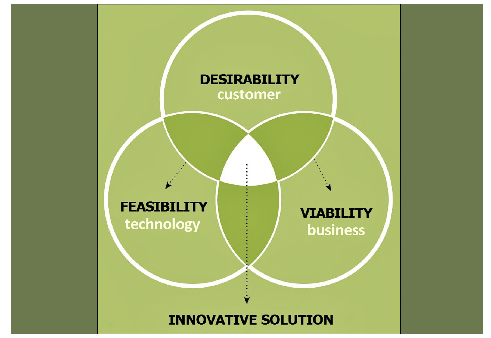

# Comp 4461 Lecture 2
- [Comp 4461 Lecture 2](#comp-4461-lecture-2)
- [User-Centered Design](#user-centered-design)
  - ["What makes a game changer?"](#what-makes-a-game-changer)
  - [Prioritising which user group?](#prioritising-which-user-group)
    - [Example 1: WhatsApp](#example-1-whatsapp)
    - [Example 2: WeChat - emoji history](#example-2-wechat---emoji-history)
      - [emoji history](#emoji-history)
      - [Emoji skin colors](#emoji-skin-colors)
    - [Exmple 3: Facebook dislike button](#exmple-3-facebook-dislike-button)
    - [Exmaple 4: Delivery service](#exmaple-4-delivery-service)
    - [Small summary](#small-summary)
      - [Innovation](#innovation)
      - [Balancing needs](#balancing-needs)
  - [What is User-Centered Design?](#what-is-user-centered-design)
    - [Empathetic Design](#empathetic-design)
      - [Why do we need to empathise? \[Oral-B kids toothbrush\]](#why-do-we-need-to-empathise-oral-b-kids-toothbrush)
      - [Main point](#main-point)
    - [Defining Design Problem](#defining-design-problem)
    - [How to identify the actual needs: Ethnographic Methods](#how-to-identify-the-actual-needs-ethnographic-methods)
      - [Immersion](#immersion)
      - [Observation](#observation)
      - [Interview](#interview)
    - [Find the Mainstreams and Extremes](#find-the-mainstreams-and-extremes)
      - [Rapid Needfinding](#rapid-needfinding)
    - [Analysis and Reflection](#analysis-and-reflection)

[Home Page](../README.md) | [Previous Lecture]() | [Next Lecture]()

# User-Centered Design

## "What makes a game changer?"
first answer was: "Cool Technology that Redefines Computing"\
-> this was later revised

issue: 
- no inherent need for that item
- user experience 
  
final answer: "Cool Technology that ~~Redefines Computing~~ Fulfills the Unmet Needs!"

## Prioritising which user group?
### Example 1: WhatsApp
Sender. why? theres no message without a sender\
e.g. blue tick: benifits the sender

Whatsapp also has a "recalled"/"deleted" feature. Why? benifit of the receiver, but also can be turned into senders' benifit since a re-called message could be edited quicly without re-typing

### Example 2: WeChat - emoji history
#### emoji history

- Initially they wanted the people to use their stickers since they sell them. 
- (suggestion by others) privacy concern

Why add? user convenience

#### Emoji skin colors
Emoji skin colors are not a thing in wechat, but is a thing for other apps
- the main user group is chinese / asians

### Exmple 3: Facebook dislike button
facebook replaced the dislike button with a set of emotions instead. Why?

- there may be other reasons for disliking a post, for instance due to the post making someone sad, instead of not liking a post.

### Exmaple 4: Delivery service
Customers complain about slow delivery -> poor rating for the drivers -> they get less orders

The delivery drivers needs are not satisfied.

### Small summary

#### Innovation

> Steve jobs:
>> "You could please some of the people some of the time"
>>
>> "You have to start with the customer experience before working on the tech"
>>
>> "What can we give to the customers?"

#### Balancing needs
Users' needs should be properly balanced. This is not a trivial task!!!

## What is User-Centered Design?
How?
1) Empathise with the users
2) Generate tons of ideas and a bunch of prototypes
3) Evaluate what you’ve made with the potential users
4) Put your innovative new solution out in the world

### Empathetic Design
Example: A new scale for a mom-to-be

"All I need is by husband" was the result of a study

#### Why do we need to empathise? [Oral-B kids toothbrush]
- Logical solution: down-sized adults toothbrush, skinny handle
- Field research: kids needed a fat toothbrush because they lack the dexterity

#### Main point
We need to talk to the users first. Is the feature really needed?\
What we think the users needs may not be the same as what they actually need

### Defining Design Problem
- Is it a problem? 
- Why is it a problem?
- What are the current solutions? 
- What is the proposed solution?
  - **Are we targeting the right problem?**
  - **What is the actual problem?**

### How to identify the actual needs: Ethnographic Methods
> "Robots won't save Japan"

Research method
- Immersion
- Observation
- Interview

#### Immersion
Become one of the users so that you may know first-hand the user experience

#### Observation
Observe the users.

#### Interview
Ask the users, know about the users' experience

### Find the Mainstreams and Extremes
#### Rapid Needfinding
> Is it actually needed / valued?

Define: Who, What, When, Where, Why

- Storyboarding -> present the context, problem, intervention and outcome\
  Tells the users what u want to do
- Role playing -> Enact the user experience
- Rapid Prototyping
  1) Low-Fidelity: Sketch Wireframe
  2) Low-Fidelity (2): Paper Prototype
  3) Medium-Fidelity (3): Interactive Mockup

### Analysis and Reflection
We need quantitative and qualitative analysis